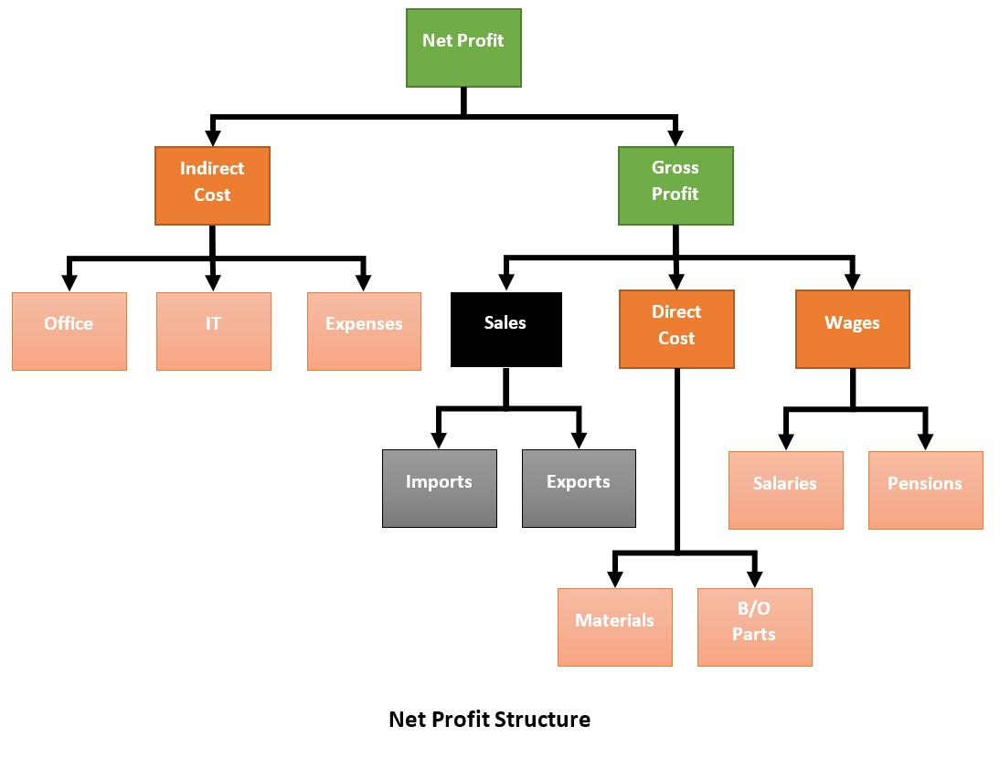
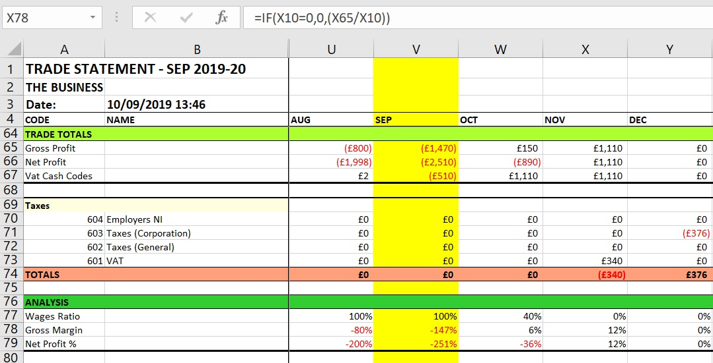

# Classifying Cash Transactions


The demos cover the structure of activities and tasks, but the classification of cash transactions is pre-configured by the Basic Setup. To address that, the following explanation explains how it is structured so you can create a meaningful configuration for your own business. 

Install the [Basic Setup](https://github.com/tradecontrol/tc-nodecore) and refer to Settings/Definitions for concrete examples.

## Categories and Cash Codes

Every cash transaction is associated with a Cash Code, describing what it is, how it fits into the business, its tax status and cash polarity. The polarity is the direction the money is taking, called the _Cash Mode_: the three modes are incoming, outgoing or neutral. However, in Trade Control, Cash Codes are not simply a list; they can form sets, called Categories, that are arranged in hierarchies of interdependence. 

Categories can be either:

- A set of Cash Codes of the same type and polarity.
- A collection of other Categories.
- An Expression that yields a value when applied to its associated transactions. 

Because categories can contain other categories, the structure is recursive, and the potential hierarchies are unbound. 

### Types

Categories define the type and polarity of its Cash Code members. Category type is either:

-	**TRADE**: the company balance is affected through an act of exchange
-	**MONEY**: for financial transactions that do not affect the overall balance
-	**EXTERNAL**: for taxes that affect the balance without a corresponding exchange

Tax Types are defined in the Tax page of the Administrator. There are three types, each with a corresponding tax rate: vat, income tax and general (e.g. corporation tax).  You can define as many tax rates as you need, but it is important to use the correct type when assigning them to transactions. A salary payment classified incorrectly as zero vat will turn up in the purchases of your Vat Statement. 

Tax Types are assigned to the Cash Code. For example, you could create a Category called _Sales_ of type TRADE with a positive polarity; then assign several Cash Codes with different default tax rates of types vat, such as Home, EU and Non-EU exports.

## Cash Totals

You can add any kind of Cash Total, but Net Profit is a legal obligation due to its role in calculating Corporation Tax. Vat also is required because the Vat Statement must exclude costs, like salaries, from your return to the government. The Basic Setup demonstrates how this is achieved. 

### Net Profit

In the Cash Total page of Definitions, Net and Gross Profit are defined. From the + button, the Gross Profit consists of one positive polarity category and two negatives. These categories are linked to Cash Codes, a few of which are shown in the diagram below. The Net Profit, however, has only two categories: Indirect Costs and the Gross Profit. The resulting hierarchy of Cash Codes is assigned to the Net Profit category in the main page of the Administrator.



To obtain the Net and Gross Profit, Trade Control firstly recurses over the hierarchy to find the set of Cash Codes it contains. It then gets all the transactions assigned to them; and because income is positive and expenditure is negative, it only needs to add them up to get the profit. In this way, since Corporation Tax is just a percentage of Net Profit, Trade Control can also calculate that tax for thousands of transactions almost instantaneously. 

### Vat

Specifying the Cash Codes for Vat should be straight forward. The Basic Setup adds the Category Codes for Sales, Direct and Indirect Cost. The total is then assigned to the Vat Statement in the options section of the Administrator main page.  It should be noted that the vat due is obtained by applying the transactions tax type. The results are then filtered by applying the hierarchy of Cash Codes specified in the Vat Total, resulting in the Vat Statement.

## Cash Expressions

Because there are no hard-coded values for profits, purchases and sales etc, information such as percentage profit can be provided by specifying a Cash Expression. A valid expression is any statement that conforms to an Excel formula, where ranges are replaced with the names of Category Codes. The Basic Setup provides a few examples, such as the percentage Gross Profit: 

``` IF([Sales]=0,0,([Gross Profit]/[Sales])) ```

The format can be any specifier that is recognised by Excel. In this case **0%** expresses the result as a percentage. The snapshot of the VSTO Cash Flow statement shows how both the Cash Totals and Expressions are rendered in the spreadsheet. The formula bar contains an example of a Gross Profit % cell derived from the above expression. The yellow column represents the current period, so you can see that your expressions can also apply to future accruals as well. 


