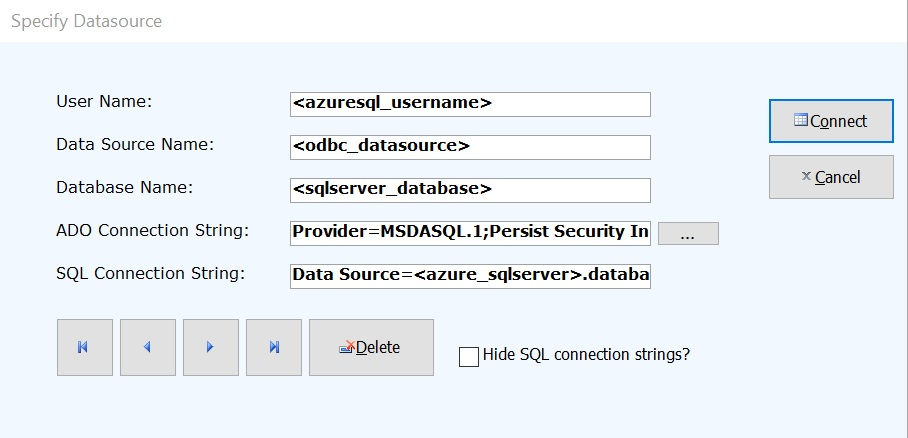

# Trade Control - Office

## Components

### Client

The main interface is a thin Access database that uses ODBC linked tables, Pass Through Queries and ADO to interact with the business entity. The Access database does not contain any business logic or queries; these are processed by Sql Server. It is therefore both a practical tool, but also a fully specified model for future developments, such as a mobile app or ASP.NET website. The client is documented in the [demos](../readme.md#demos).

### Cash Flow, P&L and Balance Sheet

The business's forward cash flow position is communicated via a VSTO Excel Template. It also includes an historical monthly P&L and Balance Sheet. This is a programmed spreadsheet that automatically retrieves live data from Sql Server and formats it according to an expressed configuration. Opening a template loads a copy that can be saved and modified locally, providing the means for snapshots and multiple companies. The VSTO XLTX template is featured in the [manufacturing](tc_demo_manufacturing.md) and [balance sheet](tc_demo_balance_sheets.md) demos. 

### Document Templates

Although the standard communication documents (Sales Invoices, Purchase Orders etc) can be spooled inside a Document Manager and emailed to Contacts as PDF attachments, Word Templates are also offered as an alternative. These templates give the business greater control over the styling of its important communications.  How to update and register them with the client is covered in the [services demo](tc_demo_services.md).

## Installation

Pre-requisite: Office 365 Business 64 bit. 

> If your machine is 32 bit, [re-compile the solution](../readme.md#visual-studio-solution) with an alternative build target.

First, if not already available, [install and configure](https://github.com/tradecontrol/sqlnode) an instance of Trade Control in Azure Sql and add data users. Use Azure Portal to register your fixed IP Address with the database firewall. Then install the following on your machine:

- [Office client installer](../src/installation/tcOfficeClient.zip)
- [Cash flow and documentation templates](../src/installation/tcOfficeTemplates.zip)
- [UK MTD Vat](tc_mtd_uk.md)

Alternatively, if you want to evaluate the system, you can replicate the [pre-release test](tc_testing.md), where you only need an Office 365 business account to complete the process.

### Options

The Trade Control client is installed into the user's local _AppData_ folder. There are two open modes: compiled and un-compiled. If you are using the [Bitcoin Wallet](https://github.com/tradecontrol/bitcoin), you must use the Native Version, since Bitcoin is not supported by the Windows OS as a Unit of Account and the client must re-configure itself locally.

#### Native Version

The un-compiled database is called _TCnode_3_ with the file extension _.accdb_. When you first open it, the Trust Centre may disable the app. If you close any open forms and enable it manually, trust should be established. By default, the database opens in run mode, with a limited development interface. Press F11 to open the Navigation Pane where you can modify or add objects. Press the SHIFT key down to open the database in non-execution mode. Even if you are not a developer, this mode allows you to hard-code changes to column orders, styling and the like. 

> **Note:**
> 
>Modifying the native version may result in your changes being overwritten by an upgrade. An empty container is provided for this purpose in the compiled version.  

#### Compiled Version

By default, the installed location is untrusted. To remove the opening dialog, add the Trade Control folder to the trusted locations from the Access Trust Centre available in Options.

The compiled database is called _TCnode3.accde_. It is referenced by _CTnode_3.accdr_, which, other than the standard reports, is an empty run-time container where you can add your own custom developments. To do this, copy the container and change the extension to _.accdb_. Any objects that you create will be visible to the menu system through the project name _TradeCustom_.

From the _Menus_ page of the Administration form, create a new menu or add your forms to those that already exist. Users can have more than one menu, so you just add the new menu to the users that require it using the + button on the _Users_ page.

### Connection

When you load the client for the first time you will be presented with the connection dialog below. The dialog is available from the menus so you can switch between companies and/or the demos.

There are two pre-loaded connections; one for Azure Sql and another for Windows Authentication. You need to create an ODBC data source and replace the tags with your own settings.

The User Name just identifies the connection. It is useful if you are connecting to Azure and more than one-person logs onto the client from the same Windows account. 

The second setting specifies an ODBC Data Source (32 bit), which is also the name of the Windows program where it is specified. Add a data source using ODBC Driver 17 for Sql Server or higher. 

The Data Source is for Access to link tables and pass-through queries. The ADO connection string is used by VBA to call stored procedures; and the last connection is passed to a COM interop assembly in the GAC to output XML, consumed by the Word templates. 

### Cash Flow

The VSTO Excel P&L and Balance Sheet should automatically request installation when opened for the first time, or just run setup.exe.

To the right of the spread sheet is an Action Pane. Upon first use, specify the server name (e.g. tradecontrol.database.windows.net), the authentication mode and credentials. If the connection is successful, save the document so you will only need to enter your password next time around.

### Templates

1. Copy the Templates folder onto a shared drive
2. Open System Admin from the client and select the Documents page
3. From the Word tab, for each document type, use the Open File button to specify the template file name. These file pointers are stored locally, since network mappings are not always universal.

When you open templates for the first time, like the P&L, they should automatically request installation. Alternatively run the setup.exe directly. 

## License

The Trade Control Code licence is issued by Trade Control Ltd under a [GNU General Public Licence v3.0](https://www.gnu.org/licenses/gpl-3.0.en.html) 

Trade Control Documentation by Trade Control Ltd is licenced under a [Creative Commons Attribution-ShareAlike 4.0 International License](http://creativecommons.org/licenses/by-sa/4.0/) 

 

