# Balance Sheets

It is a statutory requirement for all companies to submit both a P&L and Balance Sheet to the government. Trade Control can generate legally compliant, auditable versions of both. Because it is not a statutory requirement to be represented by a chartered accountant, you can optionally dispense with these expensive services and present the accounts yourself.  The following demonstration shows you how to prepare your balance sheet to do this.

## Documentation

The technical specification can be obtained from the author's [accompanying documentation](https://github.com/iamonnox/tradecontrol/blob/master/docs/tc_balance_sheet.md). 

## Requirements

[Version 3.29](https://github.com/tradecontrol/tc-nodecore)

[Client and Trade Statements](tc_client_installation.md#installation)

## Data

First install a test company trading in fiat using the [Node Configurator](https://github.com/tradecontrol/tc-nodecore#demos), then install the Services Demo with the Pay option selected. 

## Basic Implementation

Open the [Cash Flow XLS](tc_client_installation.md#cash-flow) and switch off accruals by only checking these options in the Action Pane:

Set the database connection to the test company and run the cash flow routine. You will get a Trade Statement that will be similar to the Before page in the following [sample spreadsheet](tc_demo_balance_sheet.xlsx):  

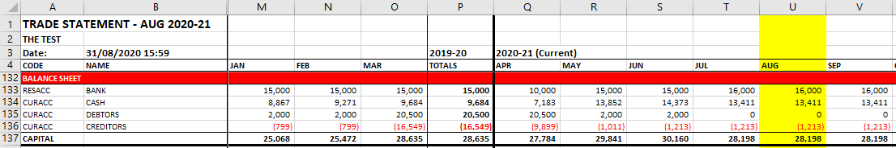

This balance sheet at the bottom of the statement is arithmetically and legally correct. However, it communicates that the business has no fixed assets, stock or long-term liabilities. To generate a more advanced balance sheet we will add the following:

1.	[Current assets](#current-assets) – physical stock and [cash box](#cash-box)
2.	[Fixed assets](#fixed-assets) – premises, van and plant
3.	[Long-term Liabilities](#long-term-liabilities) – company loan

Also covered are explanations for dealing with [accruals](#accruals-and-prepayments) and how to include assets on the [P&L profit calculations](#profit-and-loss). Firstly, we must configure the system to account for business assets.

## Configuration

### Cash Codes

Cash is classified [by three transaction types](tc_cash_codes.md#types): TRADE, EXTERNAL and MONEY. Financial transactions that involve an exchange of goods and services are of type TRADE. EXTERNAL transactions relate to government taxes, which cannot appear on the P&L or balance sheet because the money is owned by the state. Type MONEY classifies all other non-trading transactions. We use the latter to create two categories for assets and liabilities and then assign cash codes with the corresponding polarity. If you have installed the demo data, these will be automatically created, but they are disabled by default. Open Definitions and enable (or create) the Assets (Income), Liabilities (Expense) and Investment (Neutral) categories, along with their associated cash codes:

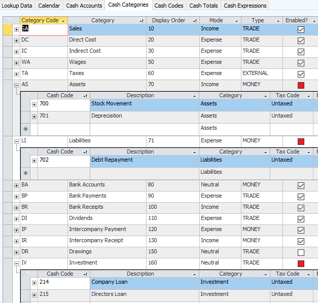

### Cash Accounts

Assets are modelled in Cash Accounts. The Cash Account Type distinguishes between CASH, DUMMY and ASSETS.  CASH types are employed in the financial side of trading. DUMMY accounts merely allow you to adjust the invoice register without impacting the bank statements. The ASSETS type is used for calculating capital. Payments for these cash accounts will not generate associated invoices. All ASSET type accounts require a Cash Code of type MONEY. The Basic Setup adds several useful asset type cash accounts which are closed by default. In Cash Account Definitions enable/open the following accounts and add XCASH for physical coins and notes. The **X** prefix ensures that it will not be the default trading account:

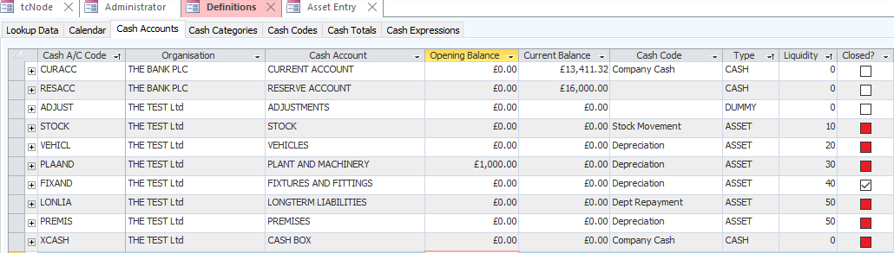

Each asset account requires a liquidity value because a balance sheet is presented least liquid first (premises=50). Zero liquidity represents the most liquid asset (cash=0). It does not matter what these numbers are, only their order. You can close all these accounts, delete them or add others. 

### Assets and Liabilities

In conventional accounting practice there are two capital categories representing assets and liabilities. Trade Control only needs a single asset type because it models assets in a projected cash account, not ledgers.  Therefore, you just enter liabilities the opposite way round. For example:

CASH ACCOUNT | REF | PAID IN | PAID OUT | CASH CODE
-- | -- | -- | -- | --
LONLIA | A long term debt | - | 50,000 | Dept Repayment
LONLIA | First instalment | 10,000 | - | Dept Repayment
PLAMAC | A machine | 2,000 | - | Depreciation
PLAMAC | write-down | - | 500 | Depreciation

The algorithm knows the first entries constitute a liability because the asset value yields negative capital and it will automatically appear at the bottom of the statement. We only need to know the payment entry is non-trading, which the cash account type ASSET provides. Therefore, we do not need this extra classification from traditional accounting practices. We can create as many asset/liability categories and associated cash codes as needed. We just set the required cash polarity against the category. If, for some obscure reason, you enter contrary to this polarity you will generate negative capital yield on an asset or positive yield on a liability.

## Asset Entry

For the purposes of demonstration, to modify the [basic balance sheet](#basic-implentation) we must add assets retrospectively and rebuild the period-end closedowns. From the [Cash Flow spreadsheet](tc_demo_balance_sheet.xlsx) we see that trade began on January 2020 and the current period is August (yours is likely to be different). 

From the Maintenance folder of the client menu, open the Asset Entry form. Here you can register assets, depreciate them or specify movement.

### Current Assets

To record stock, there will be an opening stock figure, then subsequent entries specifying stock movement. Each entry corresponds with a stock take or the period end evaluation from a stock control system. We enter these movements in one go.

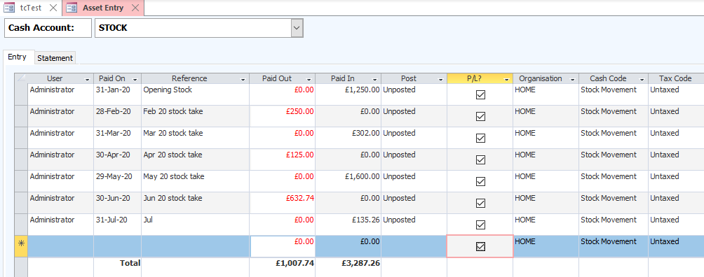

To post, change the Payment Entry Status to Posted. The Statement page is from the Cash Statement and therefore it has the same data source as your bank accounts. Since the Cash Statement by month is not very useful when reviewing assets, here they are presented in one place. The entry balance is the stock value at that time, which goes on the balance sheet; whilst the value of the Paid In or Out is carried over onto the P&L. If there is more than one entry in a period, the last balance is always used by the Trade Statement.

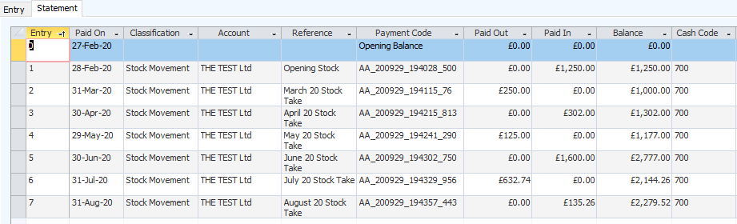

### Fixed Assets

To record fixed assets involves double-entry. The asset is purchased in a Pay Out transaction of type TRADE (in the same way as any other purchase), and then double-entered into a Pay In transaction of the corresponding asset account. We are going to buy a machine tool and a van.

1. Enter two new Cash Codes in Indirect Costs with Standard VAT Rate - 219 Machinery, 220 Vehicles
2. Open Organisations and use the Quick Entry to add a Van Trader and a Machine Tool Vendor
3. In the second month of trading (here Feb 20), use Payment Entry to buy a van for £2K and a machine tool for £1K
4. Open Asset Entry and pay in £2K into the VEHICLE cash account (Feb 20) and pay out (write down) £500 each year. Post the first two entries. 
5. Pay in £1K into PLANT AND MACHINERY and write off £250 each year end, posting the opening value and the first write down.

Trading Type entry:

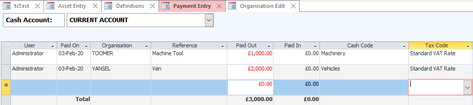

Asset Type double-entry:

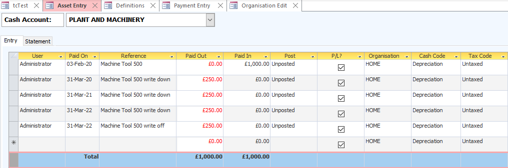

### Long-term Liabilities

Like [fixed assets](#fixed-assets), long-term liabilities are also double-entry. The process is virtually identical only the cash polarity is the other way around - pay outs are pay ins and vice versa.

The very first transaction of the current account is a transfer receipt of £10K, which represents the initial shareholding. Here we take out a company loan from the bank for a further £10K, which they deposit into the reserve account. We need to register the money as a long-term liability with a double-entry into an asset account that yields negative capital. In [Cash Codes](#casdh-codes) we enabled the Liabilities category which has negative polarity, along with a cash code for debt repayment.

Firstly, we make a trading entry that pays in the loan into the reserve account, followed by the monthly pay outs including interest (which could be entered on a different cash code representing interest payments):

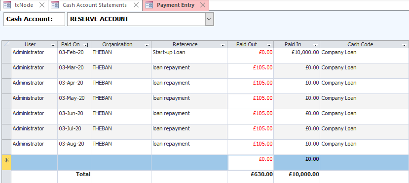

Secondly, we make the corresponding double-entry with the opposite polarity, followed by the pay offs without interest, which is a cost:

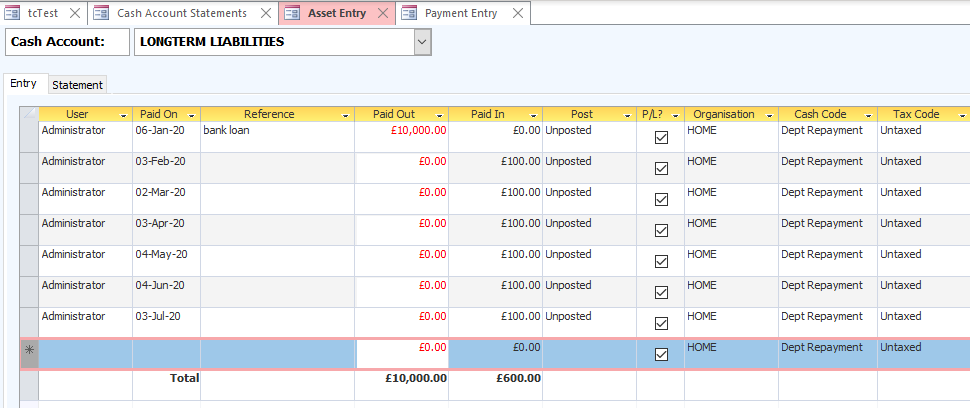

In this way, the net increase in asset value as a result of a company loan is zero. On the trading side, these debt repayments would be accrued on the Company Statement, [as explained below](#accruals-and-prepayments) and therefore the loan is not free money.

### Intangible Assets

You can add intangible or gifted assets that do not appear on the P&L. We are going to gift a building to the business and write 25% off every year. To do that, you just uncheck the P&L option. If you check it on, the business is guaranteed to make a technical loss for years to come and therefore pay no corporation tax whatsoever.

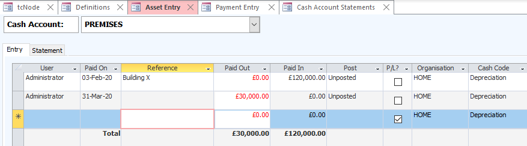

## Cash Box

To demonstrate multiple trading accounts, we have already created a cash box in the section on [Cash Accounts](#cash-accounts). There is no operational difference between your current account and this cash box. They work the same and Trade Control classifies them both as CASH on the balance sheet. In traditional accounting, cash means physical coinage in a cash box. Today, unless you are a market-stall trader, that does not make much sense, since physical cash is likely to be a tiny proportion of your available funds. Here, CASH is your working funds, and BANK is your banked reserves. 

Although the balance sheet adds cash to the current account, the Trade Statement also lists the closing balance of the Cash Box along with the other accounts (when option Bank Balances is checked). Therefore, you can decide how to communicate this category when you submit your balance sheet to Companies House - from the Closing Balances of the cash accounts or the Cash Category of the balance sheet.

### Cash Box Operation

To withdraw cash from a bank, open Transfers and move money from the current account into the cash box:

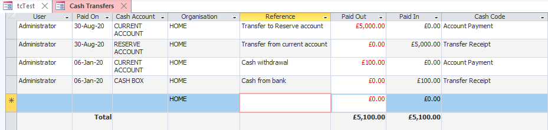

Once these entries have been posted, we have £100 in cash which we can take to the market for change, book in the takings of the day, buy stuff and deposit/transfer it back into the current account. 

For the demo, you could enter something like this:

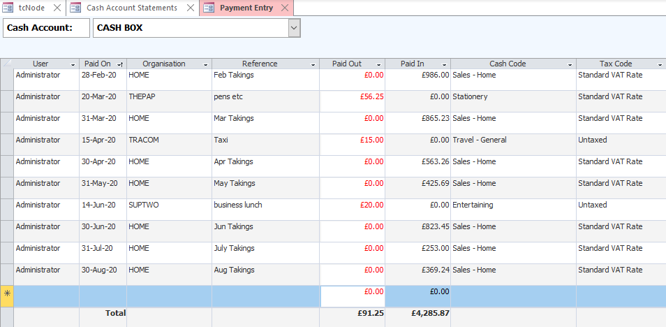

The Trade Statement shows the period end closing balances:

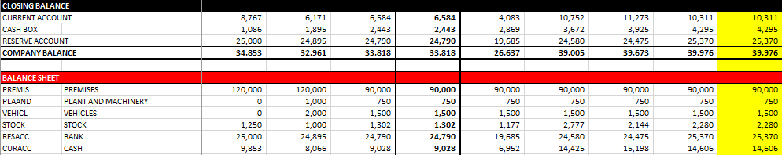

To maintain a balance around £500 we periodically deposit the money back into the current account:

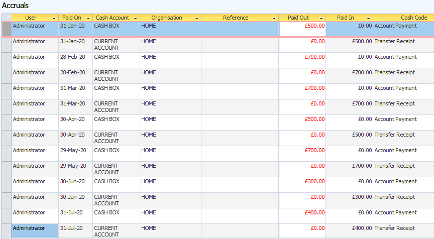

The closing balances have changed, but the balance sheet CASH category is unaltered.

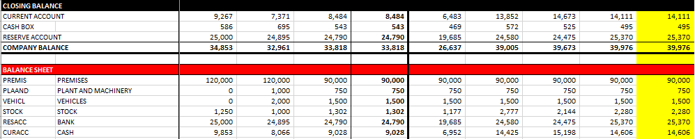

## Profit and Loss

To obtain legal compliance, we need to add depreciation, stock movement and loan payoffs to the P&L. The system, however, is principally concerned with controlling internal operations and cash, not providing the external asset value of the business for shareholders and governments. Therefore, these two perspectives are kept separate. The first section of the Trade Statement ends with a summary that expresses performance during each period. Below that, the asset types are listed:

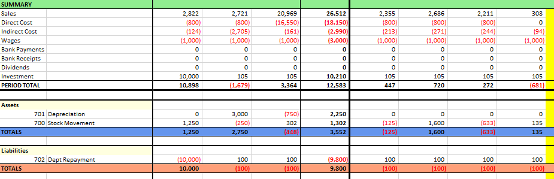

Changes in asset value need to be added into the calculations for gross and net profit. These totals are not native values but [calculated Cash Codes](tc_cash_codes.md#cash-totals). All we need to do is add in the Asset and Liability categories and they will be included in the calculation. 

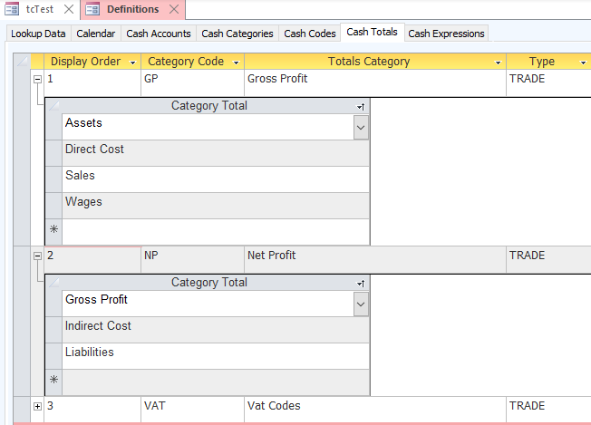

It is worth noting that all these categories, codes and calculations are configurable because you construct them from the basic building blocks offered by the schema design.

## Accruals and Prepayments

In regard to this accounting topic, it is possible to lose the will to live. However, you can avoid many of the pitfalls very simply because accruals are fundamental to the way Trade Control works. A classic example of accruals comes in the form of rent payments. 

### Problem  

A business pays monthly rent, but at year end, they pay late, resulting in a profit and hence capital over-statement of one month’s rent.  

### Solution

There are two ways to enter a payment in Trade Control: against invoices or against a miscellaneous cash code. If you pay the rent with a miscellaneous entry, an invoice will be automatically created to maintain the integrity of the organisation's statement. You can then retrospectively move the invoiced date into the previous period. However, a better approach is to use the accruals system. That way your rent will appear on the Company Statement, as well as the Trade Statement with the Live Order Book option checked. You just invoice the accruals at month end. When you eventually pay the bill, you omit the cash code and the outstanding invoices are automatically paid off. The same process applies for pre-payments: either move the automatic invoice from a miscellaneous payment or accrue the invoice in advance.

#### Method

1. Open Activities from the Maintenance menu and change the default status for Office Rent from Charged to Open.
2. From Organisations Quick Entry add **The Landlord** and set Payment Days to zero.
3. Raise a new task from Task Explorer against the landlord with the Activity set to Project, the title Rent and the action on date as the start-up date. Edit the task.
4. Add another Project activity task entitled **Rent 2019-20** 
5. Add a Tasks with the Cash Code set to Office Rent, the Action On when rent is due and a rent of £1K pcm.
6. Clone the task for each rental period to year end and change the Action On date 
7. Select the **Rent 2019-20** and clone it, changing the title to **Rent 2020-21**
8. Add the extra months to make up a full year. In future years, you will only need to change the dates.
9. Quick Invoice each overdue rent (here Jan 20 - Aug 20), making sure to change the Invoice On date to the correct period

It should look like this:

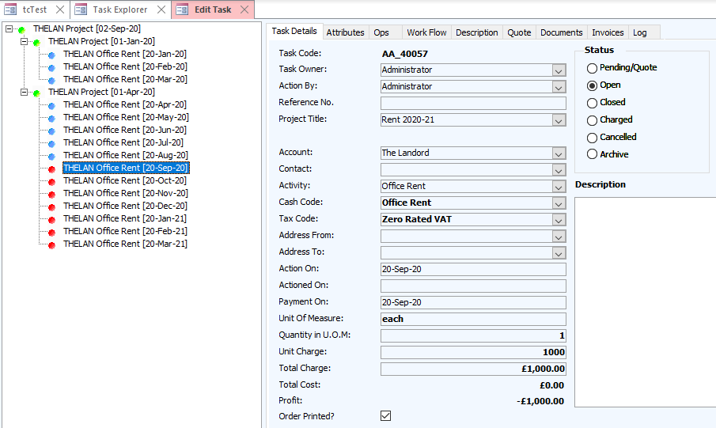

The Company Statement tells us that there are sufficient funds to pay off the arrears. We are using the accruals method, so we do not specify a cash code, but we do pay the year-end rent late and withhold the last payment:

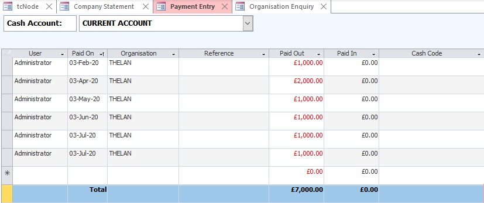

The Company Statement shows us our forward position:

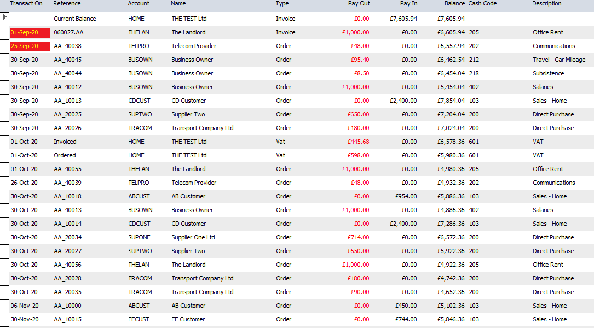

This statement tells us to transfer less funds into the reserve account.

Finally, since we have made a lot of retrospective changes, open the Cash Statement and rebuild the period end close downs. The Trade Statement shows the rent in their correct periods, irrespective of payment dates. The additional rent is for *use of home as office* from the Services Demo.

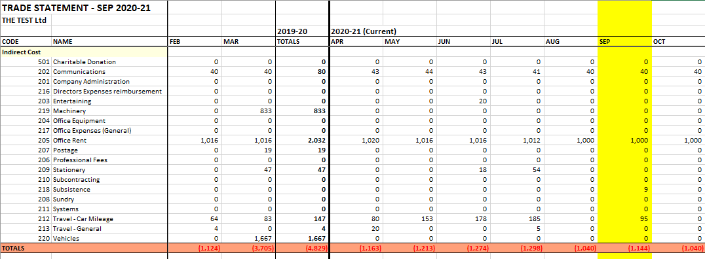

## Cash Statement

If you haven't already, hit the Rebuild button (!) in the Cash Statement. Asset Type cash accounts work the same as your bank account, with a projected and current balance. The key difference between trading accounts and asset accounts is that the former generates invoices connected to Tasks. Tasks model [workflows](https://github.com/iamonnox/tradecontrol/blob/master/docs/tc_functions.md#workflow) and workflows drive [trading networks](https://github.com/tradecontrol/tc-network). But otherwise, you can use the existing means to amend, reschedule or delete them.

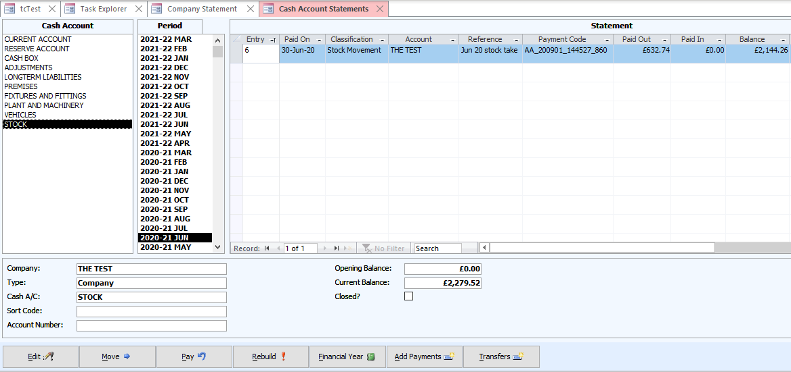

## Trade Statement

When completed, the full Trade Statement should look like the After page in the [sample spreadsheet](tc_demo_balance_sheet.xlsx). The values in the year end columns are all you need to satisfy the accounting obligations set by the government.

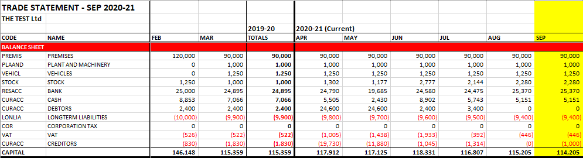

## Licence

The Trade Control Code licence is issued by Trade Control Ltd under a [GNU General Public Licence v3.0](https://www.gnu.org/licenses/gpl-3.0.en.html) 

Trade Control Documentation by Trade Control Ltd is licenced under a [Creative Commons Attribution-ShareAlike 4.0 International License](http://creativecommons.org/licenses/by-sa/4.0/) 

