# Modelling Bills of Materials

Trade Control (TC) is not a manufacturing system, it is generic; yet the design has been derived from Systems Engineering principles evolved in the manufacturing industry. To work in a factory, the design would have to include stuff like stock control, resources, tooling, quality and planning capabilities. However, it is possible to faithfully model a multi-level Bill of Materials, and generate corresponding sales, works and purchase orders from them, automatically calculating quantities and timings (in whole days) for operations and arrivals. This demo shows you how to do that. In so doing, you are introduced to more advanced features that can be applied when modelling any other kind of work flow.

## Installation

The demo is installed by the [Trade Control Configurator](https://github.com/tradecontrol/tc-nodecore). Follow the instructions until you get to the screen below. 

> **Note**
>
> The connected data user must be a TC Administrator to execute the procedure because it wipes the selected database. 

There are four modes of installation, allowing you to review how the Bill of Materials (BoM) is constructed and deployed. First install with the Activities selected, which will create the BoM. Re-running the installation, setting each option on in turn, re-creates the BoM and activates the instruction. In so doing, you can obtain a vital understanding of accruals from the Company Statement.

## BoM Specification

### Project View

Once installed, you will have created an assembly of injection moulded components as an Activity. Opening Activities from the client you should see the following:

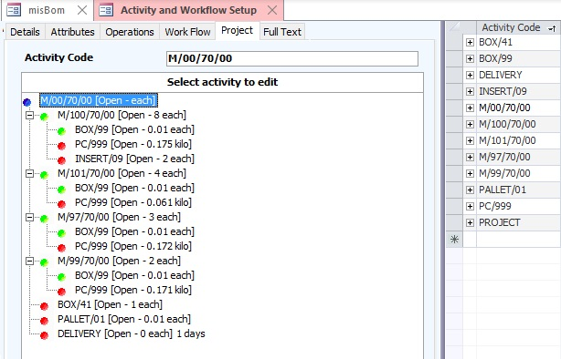

The bill of materials in the example is a shelf assembly of injection moulded parts, consisting of four components. The top level (root) of the BoM is the assembly, which has the Activity Code **M/00/70/00**. It has a blue icon to indicate it will create a Sales Order. The four components are linked in the work flow to the assembly with the required quantity used in each assembly. Their icon is green, because they do not involve financial transactions, and therefore they will generate operational Works Orders. The materials are then connected to these components, represented by a red icon for Purchase Orders.

In Trade Control, there are no native Sales, Purchase or Works Orders, but it can model them through the polarity of the [Cash Code](tc_cash_codes.md) to which they are assigned. Because the components are not assigned any Cash Code, they function as Works Orders. Manufacturing systems work differently. They assign a Part Type (e.g. ASSEMBLY, COMPONENT or MATERIAL) and have a separate control system for production.

To the right of the Project View is the Parts Master equivalent:

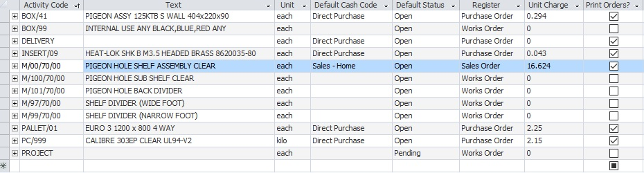

When a row is selected, the corresponding project view is displayed. Selecting the plastic **PC/999** you get a where-used listing, because it is used by more than one component. This is just an upside-down presentation of the BoM.

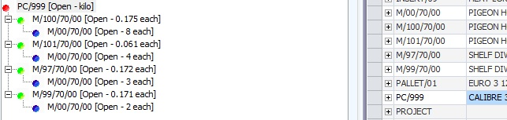

Tasks require a register that provides document level classification and a numbering system.

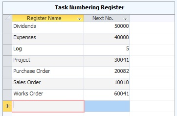

This is configured in the Documents page of Administration.

### Work Flow

Select **M/00/70/00** and open the Work Flow tab, you will see:

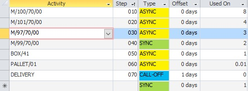

This is the list of components and activities that are required by the assembly, with the used-on-quantity needed by each one. Therefore, there are 8 sub-shelf **M/100/70/00** in every shelf. Because each child component can also become a parent, there is, at least in theory, no end to how deep or complex the BoM can be. In practice it is restricted by the technology. Recursive depth in Sql Server is exhausted at 100 for CTEs, and 32 for procedures, views and functions. This BoM is 2 levels deep.

Unlike most BoM, the work flow is sequenced, with each child activity assigned a Sync Type and offset days. Also, you can add activities to the BoM which are not a part of its actual structure, as here with **DELIVERY**, where zero UOQ switches off the BoM quantity calculation. 

Sequencing is used to schedule projects when generating sales orders (Tasks). There are three states: SYNC, ASNC and CALLOFF. The **DELIVER** activity is the last in the sequence, and because it is of type CALLOFF and offset 1, it will take place 1 calendar adjusted day before the customer wants the goods. The packing materials, **BOX/41** and **PALLET/01**, are of type ASYNC, because they will be needed at the same time as the delivery. **M/99/70/00** is marked SYNC, so is scheduled to be ready for the first operation of the assembly. The other components are ASYNC, so they would be issued to the Assembly Department at the same time. 

> NOTE: Quantity calculations can be switched off by simply setting the Used-On-Quantity to zero

### Operations

Every activity can have a set of operations, describing what needs to be done in order to make it happen. Here are the operations for the sub-shelf **M/100/70/00**:

Like work flows, Operations also have an associated Sync Type. The sub-shelf has three operations. The first op is performed by a moulding machine. Each time the mould tool opens, the mouldings will be removed by a robot. It then attaches **INSERT/09** inside the same cycle. Therefore op 20 is ASYNC. When all the components have been completed, the Quality Controller checks they are good to go. In this way, the inserts are issued at the beginning of the job, as does the operation for inserting them; and the inspector checks the work out at the end.

Operations in a manufacturing system will have a more sophisticated handling of supply, including capabilities such as resources (e.g. the specific moulding machine and robot), tooling (mould and robot tools), labour, a data rich instruction set, production and stock control etc.

### Attributes

Attributes describe the activity, and they are an important way to communicate the product or service to those involved. By default, they are listed in the standard documents that can be viewed in the Document Manager, or Word Templates if you are using them. Here are the attributes for the assembly **M/100/70/00**:

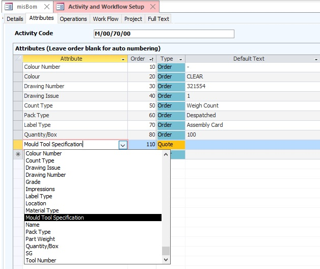 

Many of these attributes would be hard coded in a manufacturing system, but in TC you just list them in the attributes page against the activity they describe, and you build up a set. They will be carried over into the orders when they are created and modified to suit.

Attributes can be hidden from the orders sent to customers and suppliers by setting the type to QUOTE. In this case, the customer would be sent a mould tool specification with the quotation, but this would not be included in the sales order.

## Order Processing

Re-run the [demo installation](#installation) with the Create Orders option selected.

Switch to the client and open Task Explorer from the toolbar or Work Flow menu. In the Activities page you will see the assembly, components and materials listed. Selecting the assembly, you can see that 5 top level sales orders have been added, a month apart in their corresponding time buckets. Select any one of these rows and edit the task. 

### Project Schedule

The left pane of the Task Editor is a tree in the following format:

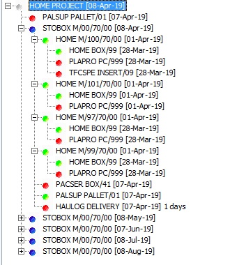

The demo installer has created a top-level project task to group all orders for this assembly into one container. This is simply achieved by adding an activity with an Activity Code set to Project, leaving the Cash Code blank, and selecting the Works Order register. You can then add a new task using this activity and assign orders by using it as a parent. 

The first order, on the 7 Apr, is a purchase for 50 pallets, to be received 1 day in advance of the first despatch. The cash code for the other pallet tasks have been set to blank, so their supply is scheduled but not ordered (green). The other materials are processed differently, in that each demand constitutes a Supplier Schedule.

Looking at the dates, you can see that the delivery and packing materials are 1 offset day from the customer's due date. Whereas the components are to be completed before starting the assembly operations. In turn, material arrivals are before the moulding begins. All these orders and operations are placed dynamically in the configured time buckets. Reviewing them in Task Explorer, you will notice that the material arrivals for the first order are overdue.  

You can select any task in the project and click the Schedule button, and all the tasks below will be adjusted to the Action On date. In practice, you might reschedule the Sales Order of the assembly, and subsequently move supply tasks around manually.

### Task Editing

Raising a new task causes the full activity workflow to be automatically added and scheduled from the Action By date. The demo installer generates the first order, then edits the suppliers, contacts and addresses that have been raised to make it. The installer then clones this order four times, schedules them 1 month apart and gives each a unique title. Try selecting a task with Activity Code **M/00/70/00** and clone it. The Task Editor will make a perfect copy of the entire BoM, ops and attributes from today. You can then amend the Action On date and Reschedule. When done, delete the sales order (or re-run the demo installer), and all the associated orders will be removed. 

When selecting a task from the tree, the corresponding task editor opens. 

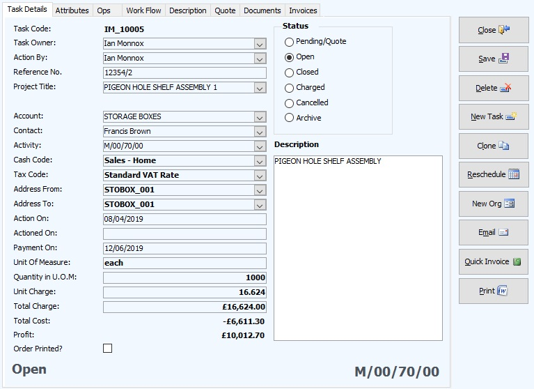

**Task Code:** The Task Code uses the specified document register against the Activity and the User Id. All the codes in TC work this way, so it is possible to go offline with a different database instance, create orders etc, and subsequently synchronise the databases without internal conflicts. 

**Action By:** The Task Explorer has a page where all tasks relating to a specific user are listed by status. Therefore, you can assign tasks to a user by setting the Action By field. 

**Reference Number:** An optional field for the customer’s order number.

**Project Title:** Because orders, tasks and operations are linked into the same tree, you can assign a project title to an entire collection of child tasks. The demo installer has re-named the top-level titles from their default description by appending a number. If you change this title, it will cascade down to all child tasks where the title was equivalent.

**Scheduled Fields:** Changing the task status, quantity or Action On date triggers a series of cascading events. For example, if you cancel an order, it will complete the operations and cancel all the project’s open tasks as well. However, normally task status changes from the lower levels up.

**Addresses:** If you select a delivery task you can see that the haulier is able to collect and deliver to any address in Organisations. Address codes are, like all codes in TC, alpha-numeric and are automatically generated by appending an address number to the organisations Account Code.

**Payment On:** Calculated by adding the payment days, or EOM if checked, communicated to the customer plus the expected days extra, then adjusted to the active user's calendar.

**Profit:** Job profitability is calculated each time a task is selected. The algorithm recurses over the tree, gathering charges by applying the Cash Code polarity, summating the result. This simplicity is possible because of the way TC is designed. 

**Task Activity Pages:** The Attributes, Operations and Work Flow pages are either cloned instances of the Activity, or another Task. They can be amended, added to or deleted in any way. Their features have been described above.

**Quote Page:** Allows you to enter quantity and price breaks to your quotations

**Documents:** You can add as many documents as you like to each task - pdf files, word docs, xls, images, cad, whatever. These are stored in the Sql Database, which apparently can go up to 100TB these days, if you can afford it. The Azure Basic Tier is currently 4GB. These documents, however, are not clonable, but you can cut and paste them. All the documents are visible in the Document Warehouse from the menu.

### Company Statement

The Company Statement is a dynamically calculated snapshot of your business's position. In accounting terms, it could be regarded as a forward-looking transaction grained balance sheet. If you modify any financial data from the past, or the future, it will impact either the opening balance, or its projection. If you have run the demo with the Create Orders option, you will have borrowed some start-up money from the bank (see Cash Statement) and raised several un-invoiced sales and purchase orders.

There are two projections: one for the current account and the other for an optional reserve account. Current accounts have a Cash Code of type BANK, whereas the Cash Codes of reserve accounts are left blank. The first line in each is the current balance. The forward order book is placed on the statement, along with Vat due and corporation tax, using their expected Payment On date. The forward balance is then projected from current balance across the active periods and tax horizons set in Administration.

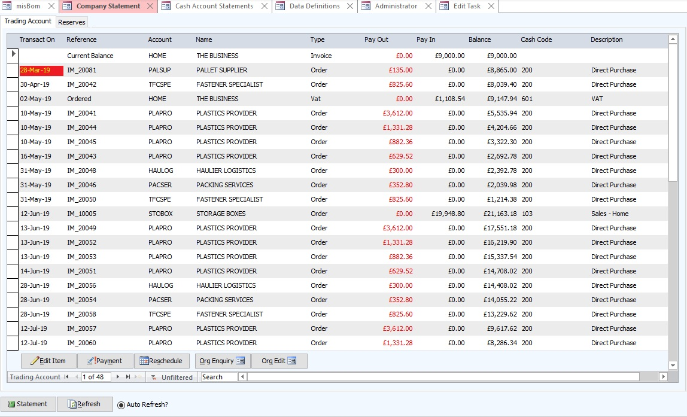

From the Company Statement you can edit and reschedule orders, invoices and accruals or pay and collect from them. This gives you a great deal of control over your forward planning, because every time you amend the order book or pay an invoice, the vat and corporation tax will adjust accordingly, and there will be a new projection. And if you amend the past, the current balance changes so that it no longer matches your actual bank account, so it is easy to spot anything that requires reconciliation.

Because the Company Statement is dynamically calculated, it will depend where you are in the financial year as to how it will look for you. To amend the financial years and tax periods open the Tax and Period End pages of the Administrator where these settings can be modified. Because the demo installer has created an overdue order, you must borrow money or invest to prevent being overdrawn. Open the Cash Statement, which is basically a perfect reflection of your bank account and delete the Company Loan entry. The current balance is zeroised and your projected balance goes into the red. Also try cloning a project and rescheduling it to see how it impacts on the Company Statement and the P&L.

### Cash Flow

Even though you have not invoiced anything yet, using the accruals system, there can be a P&L to match the Company Statement. Install the Cash Flow VSTO Workbook and add the connection to the BoM database. Then set the flags to the following settings.

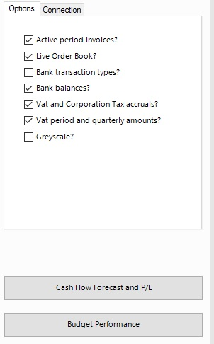

The Cash Flow should look something like this:

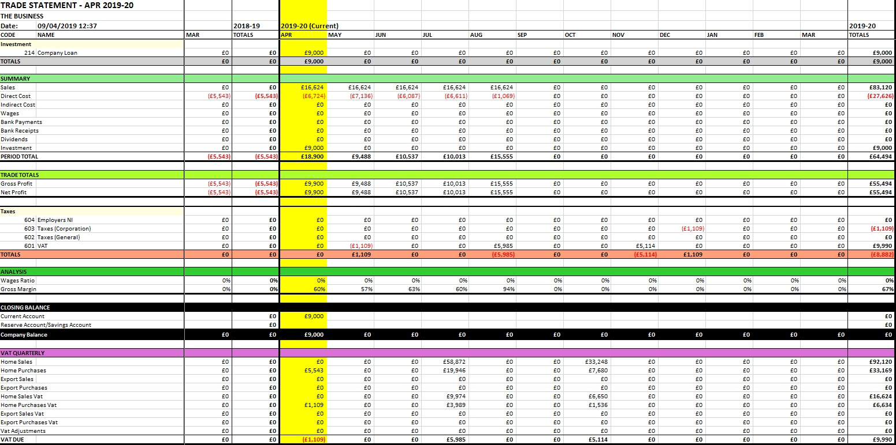

> NOTE: If you are running this in April, which is the start month of the basic configuration, you will need to unarchive the financial year to see the overdue orders.

The yellow column is the active period. Each Cash Flow generation is rendered from scratch using the Categories and Cash Code classifications, then applying the Cash Totals and Expressions specified in Definitions. The quarterly VAT, presented to the Inland Revenue in the UK, is taken from the Vat Statement in the Invoice Register, as is the Corporation Tax (both set at 20% here). The Taxes section shows the accrued Vat and Corporation Tax, adjusted by the offset days of the Tax Type. If you check out the Invoice Register Vat and Corporation Tax Statements, however, they will be empty. That is because taxes are not due on un-invoiced demands.

## Invoicing

Re-run the [demo installation](#installation) with the Invoice First Order option selected.

Refresh the Company Statement and every order relating to the first sales order has been replaced with an invoice. The overdue order book has been resolved, but overall the company is in the same position.
Render the Cash Flow again and you will see that, with the flag settings in the previous section, it is roughly the same. The only difference is that the overdue accruals are now in the current period, pushing the corporation tax payment into the following year. Uncheck the live order book flag and the invoiced project can be seen.

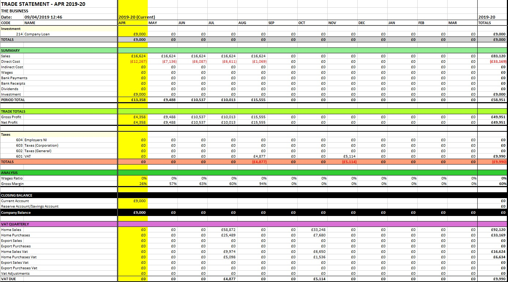

### The Invoice Register

Natively, there are no sales or purchase invoices, and no credit or debit notes in TC; there are only invoices with an associated polarity. Therefore, whether the invoice is received from a supplier, or sent to a customer is a difference in state rather than object. However, to make the system more in line with current thinking, the Invoice Register is presented as if they are all different objects. There is therefore a numbering system associated with each document type, which can be amended in the Documents page of Administration.

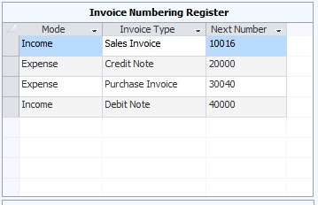

The Invoice Type is then used by the Invoice Register to present the four kinds of invoices users have come to expect. Opening the Invoice Register from the Information menu gives you access to every invoice within the active financial year and allows you to edit or delete them as needed. Invoices can be raised from the Work Flow menu, which has a multi-item capability; or directly from the Task Editor, where subsequent items can be added (such as miscellaneous charges like carriage). Your register should match the following:

The pages shown are self-explanatory, except perhaps Expenses or Expenditures. These are simply purchase orders that are not related to a sales order. Which is to say, they are Tasks with a negative Cash Mode unconnected to a Work Flow that contains a positive mode. 

Result sets in TC are created dynamically, except for Invoice Status. Invoices are paid on a FIFO basis as you go along, across these states: Pending, Invoiced, Partially Paid, Paid. If the invoice has been set to full or partial payment and you amend the invoice retrospectively, you must re-build the organisations account from the Org Editor. This seldom happens because you would normally expect to receive or issue a credit note. Payment amendments are more frequent, but they will re-build the Invoice Register automatically.

### Status and Performance

Check out the Status Graphs from the Information menu.  Only one period and one project has been processed, but it is starting to look the part.

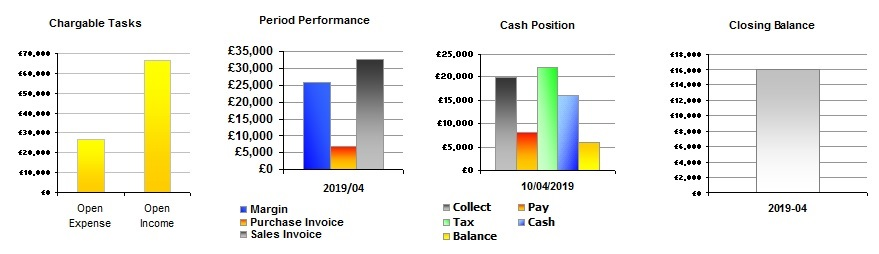

From the same menu, Job Profit provides performance reporting by project, available as a report or exportable dataset, which includes payment status. Costs are calculated anew using the same recursive algorithm as the [Task Editor](#task-editing).

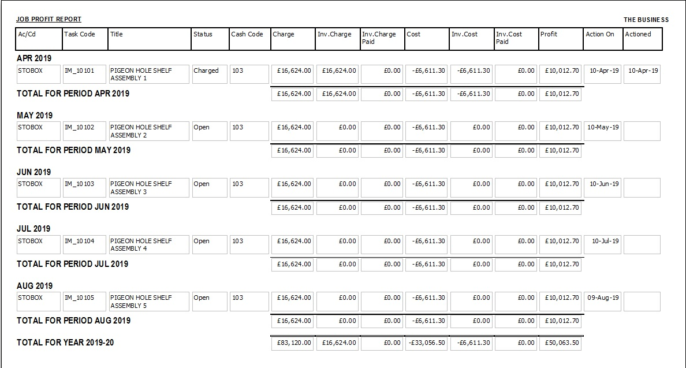

## Payments

### Organisation Statement

Before re-running the demo installation to pay these invoices, you could try out the payment system by paying the Unpaid Purchases in the Invoice Register manually. It is very straight forward.

There is a flag in Organisation Edit called Pay Balance. If it is OFF then only the earliest invoice outstanding will default, otherwise the entire balance is calculated. You can still pay any amount you want by overriding this figure. Setting the Pay Balance OFF for select accounts is useful if you pay the schedule from the Company Statement, individually relating an invoice to each payment, as does the demo installer; or you can pay the lot in one go, as we will do here. 

Open Payment Entry and paste in the Account Codes of the Unpaid Purchases from the Invoice Register, and the total outstanding will be set by default. Leave the Cash Code blank and the payment system will pay off invoices on a FIFO basis.

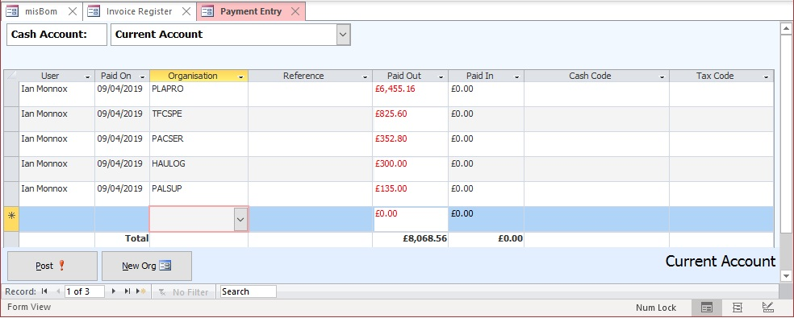

Post the payments, then open Organisation Enquiry and locate the **PLAPRO** account (or select a **PLAPRO** order in the Company Statement and open Org Enquiry). The Enquiry includes the Organisation Statement below:

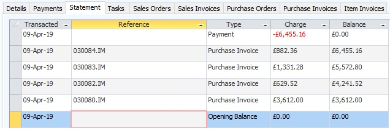

The Organisation Statement is presented in reverse projection because it builds up over time, and you will want to see the latest balance outstanding. Check out the statement of the **STOBOX** account. Worth noting is the fact that purchases yield a positive balance to the supplier, but negative for the customer. The Organisation Statement is therefore from the point of view of the organisation, not the business. It means that the business must register a payment with a negative polarity to address the balance, reducing the bank balance accordingly. In this instance by -£6455.16.

### Payment System

Run the [demo installation](#installation) with the Pay Invoices option selected.

Rendering the Cash Flow again with the specified [settings](#Cash-Flow) returns the same results as previously, except the bank balance has increased. The same has occurred with the Company Statement; except the invoices have been removed, and their value added to the current balance.  Refreshing the Invoice Register shows that all the invoices have been set to Paid.

### Cash Statement

The Cash Statement is a mirror image of your bank account, with the additional capacity to classify transactions by Cash Code and split out the tax content. Below is the statement after you have run the demo installer. It is slightly different from the manual approach you have just carried out, because the installer has invoiced each demand on the Supplier Schedule, but the balances will be the same.

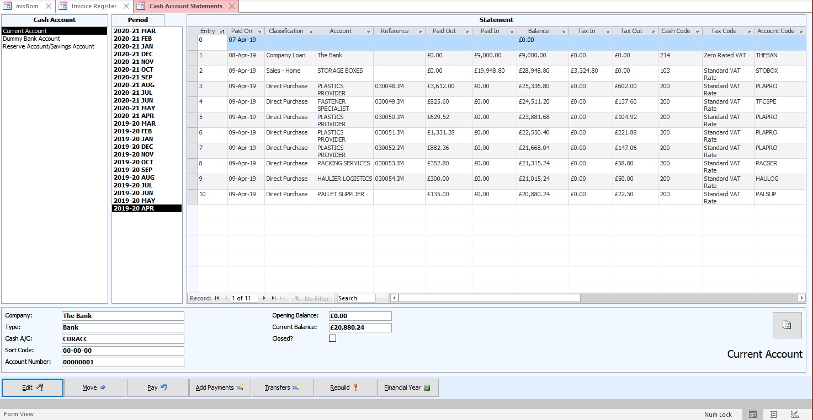

You should not need to run the Re-build function, but if you do, under normal conditions it will have no affect. It is useful to integrate imported data into the system, repair corrupted data, an impacting upgrade or because certain essential information has been changed (like moving the financial year).

## Project Processing

### Task Explorer

The Task Explorer is the go-to place for:

- Amending the current schedule
- Managing your own responsibilities 
- Gaining access to historical projects
- Activity Code, Account and Contact enquiries
- Managing the active Sales and Purchase Order Books

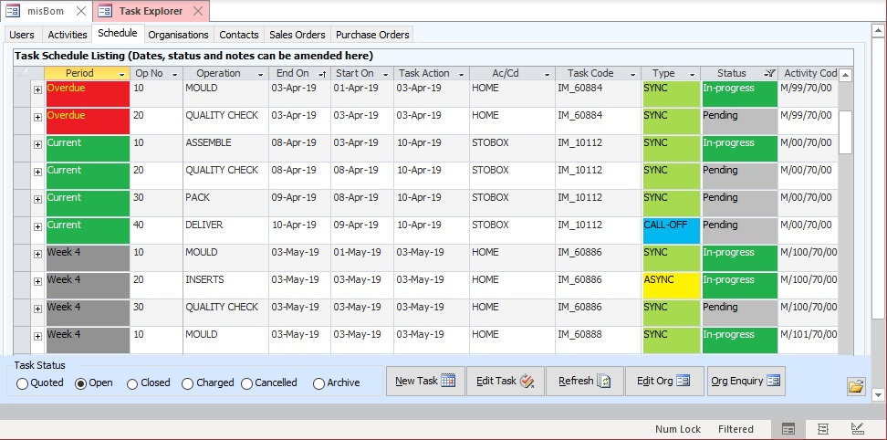

### Document Manager

There are two document systems for communicating with other organisations:

- A Document Manager, which presents the document types in a traditional way, monitors if they have been sent, and can spool multiple orders in one generation.
- [Word VSTO Templates](tc_office.md) that can be modified to match your business style, populated from XML schema.

Both can email a pdf document to the contact's address directly from within the client. Reports in the Document Manager are more flexible. In manufacturing, you would probably need a Supplier Schedule, instead of lots of single line Purchase Orders. 

You can write your own reports, and then tell the Document Manager what report goes with which Document Type, and how it is to be communicated by default. These are listed in the Selected Report box.

There is no limit on the number of reports or Word Templates you can add to a Document Type. They are added in the Documents page of Administration. Word Templates are located locally, whereas Manager configuration is universal. Therefore, to avoid error messages, you would need to distribute your new reports.

## A few other things to try out...

Check the EU Jurisdiction flag for customer **STOBOX** and refresh the Invoice Register Vat Statement, or the Cash Flow.

Render the Cash Flow with different [settings](#Cash-Flow).

Open the [Status Graphs](#status-and-performance). Try cloning a few orders, invoicing and paying them. You will see how the overall tax burden and financial position reflects changes at transaction level speed. (F5 refreshes)

Why not create a bill of materials yourself, for something simple like a plastic pen? You will need to:

1. Model the BoM in Activities by first adding the top-level product code, its components and materials to the Parts Listing
2. Assign the correct Cash Code so it knows the direction of money and service. Set the Default Status to Pending
3. Link them together to create a work flow with meaningful UOQ and Sync Types
4. Add attributes to describe them
5. Insert operations to instruct the steps needed for their manufacture
6. Create a customer to buy them 
7. Suppliers to provide the materials (or use the ones in the demo)
8. Add a top-level Project for the customer from Task Explorer
9. Edit the Project and add the top-level product code, status Pending/Quote
10. Assign suppliers and costs to the materials and sub-contractors
11. Quote the suppliers 
12. Select the top-level and check out the cost and price for a healthy profit
13. Open the quotation for review from the Document Manager
14. If the quote is acceptable, change the project's status to Open
15. Using the Company Statement, follow through this demo until all the suppliers have been paid and customer's money is in the bank

In a real factory, you must do a lot more than that - exciting duties like stock control - but you will learn the basics and familiarise yourself with the system.

## Supply-Chains
Trade Control instances are nodes that can be connected together, such that BOM-like workflows can operate over supply-chains. Install the [Trade Control Network](https://github.com/tradecontrol/tc-network) and try out the demo. It shows you how to schedule the entire supply chain for both customers and suppliers of the assembly.