# Services Demo

## Author

Steve Wicks, [Greenprint Consultancy Ltd](http://www.green-print.net)

## Overview

Trade Control (TC) has been derived from Systems Engineering principles evolved in the manufacturing 
industry but is highly adaptable and has been used as an MIS by a print management company since 2008.
A test system has been created based on a fictional print management company to demonstrate the system's 
capabilities and flexibility.

The system allows users to generate and clone (copy) tasks in an intuitive and efficient manner. These 
tasks can be sales orders, purchase orders, expenses or other activities. They are defined in an Activities 
register which sets the polarity of the transaction (i.e. income/expense/off). Every Activity can also include a generic
list of properties (Attributes) and a schedule of the individual processes (Operations).  Ops can
be set to create automatic timings (in whole days) working back from a defined completion date. 
This demo shows you how to set up and manage these processes. 

## Installation

The demo is installed by the [Trade Control Configurator](https://github.com/tradecontrol/sqlnode). Follow the instructions until you get to the screen below. 

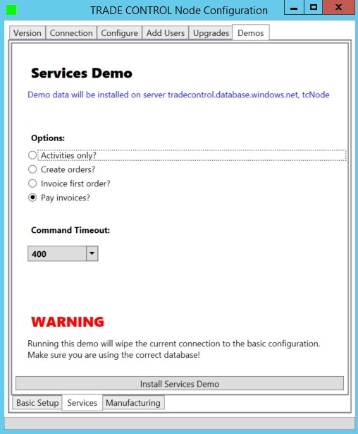

Because the procedure wipes the selected database, you must be a TC Administrator to execute it. 

Select the Pay Invoices option first, then [try out the other options](#install-options) at the end of the demo.
 
# Introduction to the System

## Menu

Clicking on the + symbol to the left of the folders in the Home screen gives you an expanded view. The below screenshot shows all the options on the default Administrator menu:

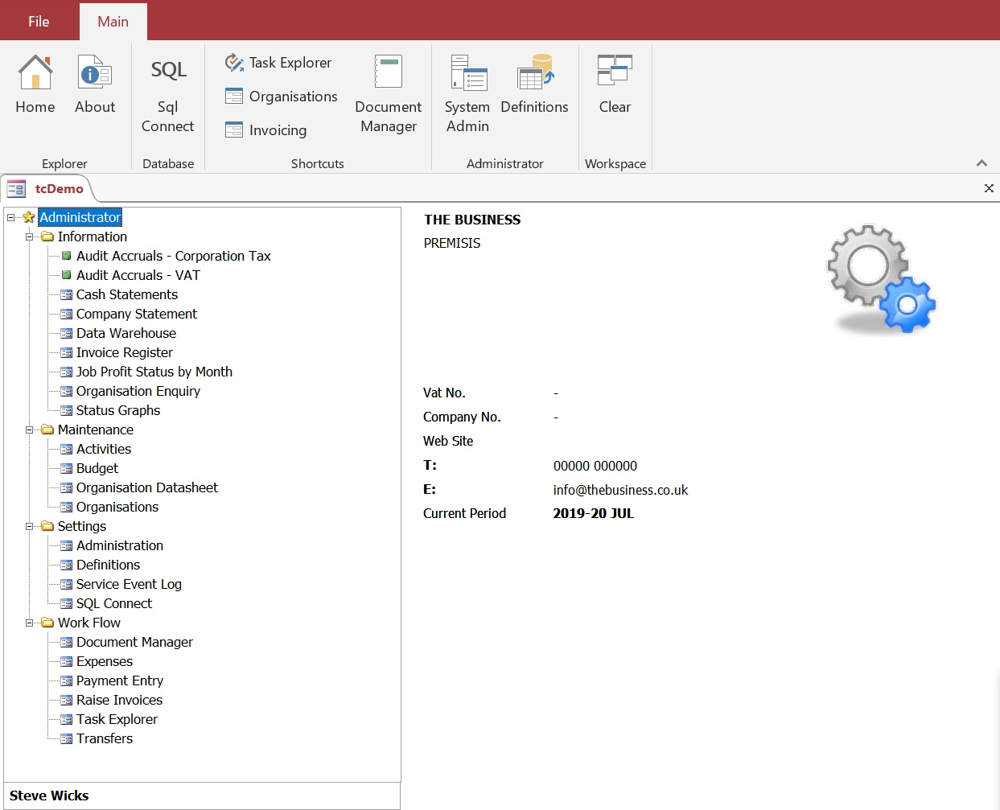

In addition to selecting a folder from the left-hand tree, many frequently-used folders can be accessed with a 
single click from the Main tab, such as Task Explorer, Organisations and Invoicing. An overview of each folder
is provided later in this document, but for now we will focus on the basic tasks of raising a new task and 
creating dependent (child) tasks where required.

## Task Explorer

Task Explorer is the go-to place for:

- Amending the current schedule
- Managing your own responsibilities 
- Gaining access to historical projects
- Activity Code, Account and Contact enquiries
- Managing the active Sales and Purchase Order Books

Task Explorer can be opened either from the Work Flow menu or from the Main tab on the toolbar. It contains 
tabs which enable users to view tasks in various ways:
Users / Activities / Schedule / Organisations / Contacts / Sales Orders / Purchase Orders

Within each tab users can filter the results:
Quoted / Open / Closed / Charged / Cancelled / Archive

A useful view is shown below, with the Schedule tab selected and only Open tasks selected via the filter.
This effectively shows all open tasks by activity, as assigned in the Ops tab (see Edit Task). In this view, 
with the order sorted by End On / Oldest to Newest (left click arrow in the header of the End On column) and 
the Task Status set to Open, users can see a definitive list of all scheduled operations:
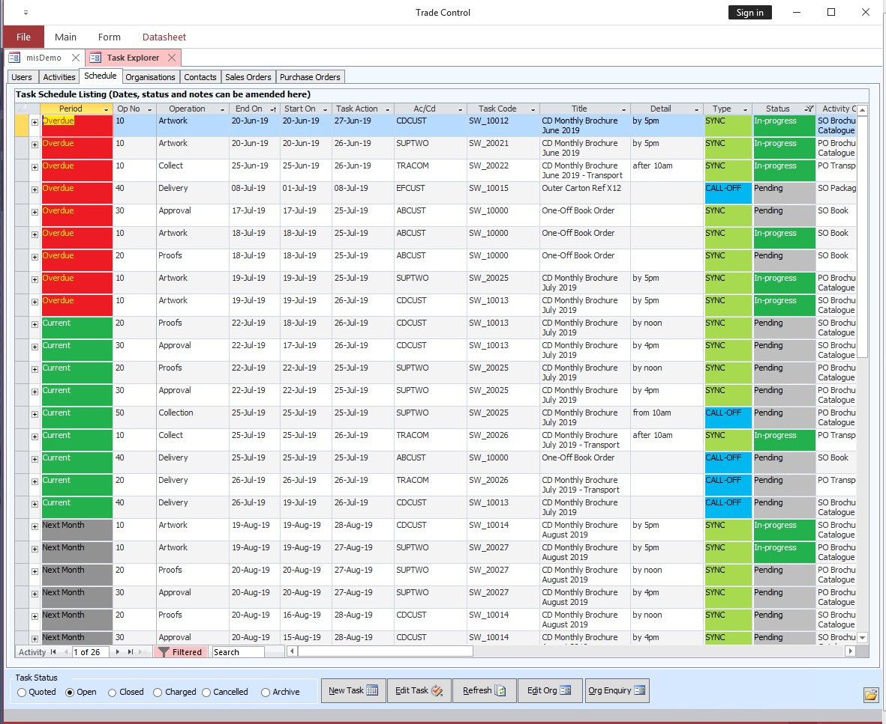

This is an effective way to project manage all open tasks. Selecting the required row and clicking on Edit 
Task opens the Edit Task tab and allows access to the full task details along with any related sales or 
purchasing activities.

The Status of the Activity can be updated within Task Explorer by selecting the required row, left clicking 
the arrow in the Status column and selecting the required status - Pending / In Progress / Complete.
Selecting "Complete" and refreshing the screen will result in the activity no longer appearing in this view.

Any overdue activities can be rescheduled by selecting the End On date and selecting a new date from the 
calendar or by editing the task and updating the dates in the Ops tab.

## Creating a New Task

Task Explorer is also where new tasks are set up by clicking on the New Task button and entering the details.
Here is a view of a New Task screen where the details have been entered prior to selecting the Accept or Edit 
Project button:
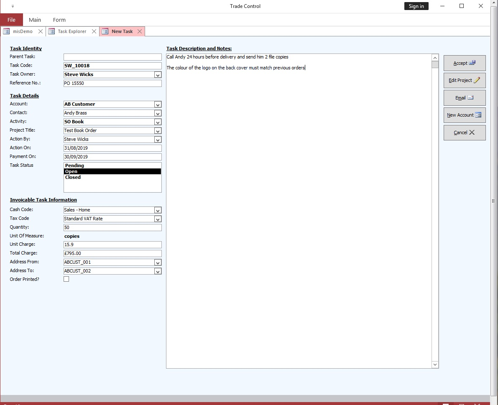

**Task Code:** The Task Code uses the specified document register against the Activity and the User Id. All 
the codes in TC work this way, so it is possible to go offline with a different database instance, create 
orders etc, and subsequently synchronise the databases without internal conflicts. 

**Reference Number:** An optional field for the customer’s order number.

**Project Title:** Because orders, tasks and operations are linked into the same tree, you can assign a project 
title to an entire collection of child tasks. If the title is changed, it will cascade down to all child tasks 
where the title was equivalent.

**Action On:** This is the scheduled completion date for the task. The Action On date can trigger a series 
of cascading events. If child tasks are automatically created (as defined in the Work Flow for the selected 
Activity Code) and Offset days are set up in the Operations tab in Activities, then the 
child tasks will automatically be created along with the current task and any scheduled operations will be calculated 
based on the Action On date.

**Payment On:** This is calculated by adding the payment days as defined in the Organisation record to the Action 
On date. If End of Month payment is checked in the Organisation Record then the Payment On date will determine the 
last working day of the month the payment falls due.  If there is an entry in the 'Expected Days Extra' field in 
the Organisation Record, the extra days will be added to the due date then adjusted to the active user's calendar. 
The Payment On date is important as it is used to manage cashflow forecasts in the Company Statement module. 
Dates can be overwritten by the user if a specific payment date has been arranged outside of the system parameters.

**Task Status:** The default status for the selected activity will be selected automatically.  In the above example, 
the "SO_Book" activity code is set to in Activities to default to Open, but it can be set 
to 'Pending' (i.e. not a live task, so it will not appear in Task Explorer when the 'Open' filter is selected) or 
'Closed' (i.e. not a scheduled forward task, but a current or retrospective task which can be closed once it is 
created, such as an expense).

**Cash Code:** The Cash Code will be automatically selected based on the chosen activity. If there is no cash code 
assigned to the chosen activity, such as with the 'Project' activity code, it will have a neutral impact on cash 
flow.

**VAT Code:** The VAT Code will be automatically selected based on the chosen activity, but it can be overwritten 
if required. Many printed products are zero rated for VAT but there are rules which might change the VAT status of  a particular product, so the ability to overwrite the default VAT status is important.

**Unit of Measure:** This is determined by the activity and is assigned in Activities. It 
cannot be overwritten within this New Task screen.

**Addresses:** Both the 'Address From' and 'Address To' fields will default to the first address as set up within 
the Organisation. Alternative addresses can be selected from a list of additional addresses as set up within the 
selected organisation. Address codes are, like all codes in TC, alpha-numeric and are automatically generated 
by appending an address number to the organisations Account Code.

**Task Description and Notes:** This is a free field where any in-house notes can be made, as these notes will not 
appear in the task attributes which will populate sales and purchase orders.

When all of the required data has been entered, selecting the 'Accept' button will create the new task along with 
any related tasks. If the Edit Task tab is already open, the new task will appear in place of any task which was 
previously selected. If the Edit Task tab is not already open, the new task will be created but will not be visible 
for checking or appending. Users would then have to locate the task in Task Explorer or via Organisations, selecting 
the required task from the Tasks tab.

For this reason, it is usually best to check the second button 'Edit Project' instead of 'Accept' will ensure that 
Edit Task is opened if it was not already open. The next section explains the key features in Edit Task.

## Edit Task

The Edit Task screen is where users can add detail to or amend any task and can also create new tasks within
the project, such as a purchase task as a 'child' task which is attached to the sales 'parent' task. If a
new task is created for an activity which is set up with an automatic work flow (see Activities and Work Flow) 
then any child tasks are automatically created at the same time. But additional tasks can be set up manually 
by selecting the New Task button. Existing tasks can also be 'Cloned', creating a duplicate new task along with 
any linked tasks, with a new default Action On date of today. It is important at this stage to understand the way 
that the system creates task structures so that the required outcome is achieved.

Tasks are assigned based on the relationship with the active task when the New Task button is selected. If the 
active task is a top-level task (i.e. it has no parent task above it), then the new task will be created one of 
three ways:

- If both the active task and the new task are both sales tasks, the new sales task will open as a completely 
separate, independent structure (along with any dependent child tasks assigned to the activity code as defined 
in Work Flow).

- If the both the active task and the new task are purchase tasks, the new purchase task will open as a 
linked task, being the child part to the parent purchase task.

- If the active task is a sales task and the new task is a purchase task, the new purchase task will open as a 
linked task, being the child part to the parent sales task.

If the active task selected when the new task is created is not a top-level task (i.e. it is linked to a higher 
branch above it) then the new task will be created as part of the tree. So if you create a new sales task, it 
will be a child task to the top-level parent task.

Having a good understanding of the relationships between activities and the way in which TC creates new tasks 
from within the Edit Task screen will ensure that users achieve the desired outcome. The ability to create an 
over-arching top level parent task under which all other tasks sit is an extremely useful feature, allowing 
users to group all related activities together. So, a top-level task can be created as a container for one
complete project containing multiple sales tasks with their subordinate purchase tasks, all shown as branches 
of the same tree. In order to set up a top-level project task which is not in itself an active task, the cash 
code Project should be selected when creating the task, as it has no linked cash code so is not assigned a cash 
polarity. Once you have created this top-level task, clicking on New Task and creating multiple sales tasks 
along with their dependent purchase tasks will ensure that all activities are linked to the top-level parent.

To see an example of this, go to Task Explorer and click on the Users tab. You will see an entry for an 
organisation named BUSOWN (Business Owner") with the activity code 'Wages monthly payment'. Select the row and 
click on the Edit Task button. You will see a tree of 12 monthly wage payments for each month of the year linked 
to the top-level parent task 'Salaries'. Because the parent task has 'Project' set as the activity code 
(which has no cash code assigned to it) and the Activity is set to 'Pending/Quote' it does not appear as a live 
project, but it serves as a placeholder for all the related activities which is a very convenient way to 
manage related or repeat tasks.

Raising a new task causes the full activity workflow to be automatically added and scheduled from the Action 
By date.

The Task Editor will make a perfect copy of the complete tree including all ops and attributes scheduled from 
today. You can then amend the Action On date and Reschedule. 

When selecting a task from the tree, the corresponding task editor opens. 

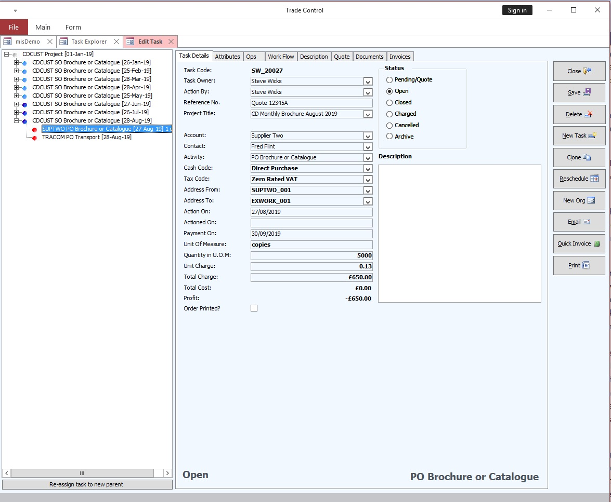

Here you can see that there are two purchase tasks linked to one sales task which is retained along with other 
related sales tasks for the same client under the Project parent task.  Click between the tasks to familiarise 
yourself with the relationships between them and try creating new tasks both as a child to the parent sales task 
and as a child to an existing purchase task. Although using TC as a simple buying and selling control system 
for this fictitious print management company would not require purchase tasks to be created as a child task to a 
parent purchase task as all purchases would link directly into the parent sales task, users may find that this 
functionality, which allows a multi-level Bill of Materials structure to be created for engineering applications, 
can be used in other ways.  Once you have understood the relative connections and how clicking 'New Task' assigns 
the new task to the currently selected task, you can determine the optimum structure for your application.
 
Cloning is another very useful feature. Instead of having to set up new tasks from scratch in Task Explorer, an 
existing task can be selected and cloned. The existing task may be Quoted, Open, Closed, Charged, Cancelled or 
Archived but when it is cloned the new task will be given the default Status based on the task's Activity Code. 
The Action On date for the cloned task will be set to today’s date. Again, having a clear understanding of any 
existing relationships is important when cloning. Any child tasks will be cloned along with the selected task, 
so make sure that you have selected the correct task. For example, if you selected a purchase task instead of the 
parent sales task, the cloned task would be created as a new child task linked to the original sales task, 
duplicating only the selected task level along with any child tasks linked below it.

**Edit Task - additional features**
Having now covered the basics of creating and editing tasks, we move to looking at the other tabs in the Edit Task
tab. These are:

    Attributes
The example below shows the attributes for sales task SW_10014, a monthly brochure. The core attributes are set up 
in Activities, and therefore populate the original task when it was first created. These attributes 
were appended and adjusted to reflect the job specification, containing all the details required to generate a 
sales order acknowledgement. Then, the original task was Cloned each time a new month's order was confirmed. Cloning 
brings through the attributes exactly as per the original task - it does not bring through the 'template' attributes 
assigned to the task activity code. 

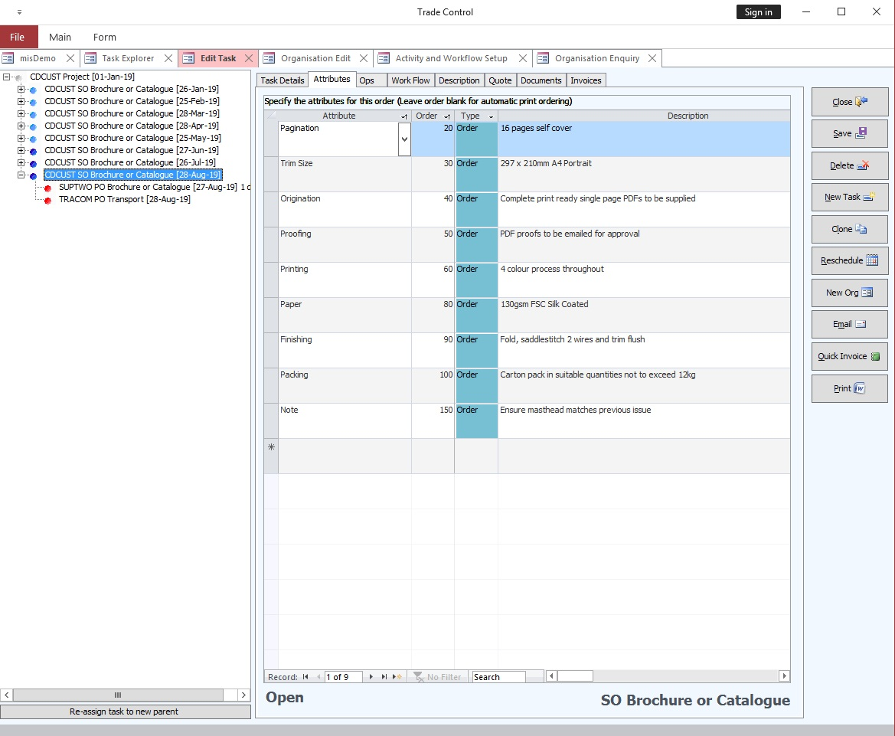

If an additional row is required, select the first empty row below the existing rows and type in the Attribute, Type 
and Description. The position of the row can be defined by assigning the number in the Order column to a number 
which falls between existing row numbers e.g. the existing row numbers run from 20 to 150, set 10 digits apart, so 
if you want to add a new row between "Paper" (row 80) and "Finishing" (row 90), make the number between 81-89 and it 
will appear in the desired position once the screen is refreshed (hit F5 to refresh).

Many of these attributes would be hard coded in a manufacturing system, but in TC you just list them in the 
Attributes page against the activity they describe, and you build up a set. They will be carried over into the 
orders when they are created and modified to suit.

Attributes can be hidden from the orders sent to customers and suppliers by setting the type to QUOTE. The row will 
then not be included in the sales order but will only show in any quote which you might generate from the task.

    Operations (Ops)
 
Every activity can have a set of operations, describing what needs to be done in order to make it happen. Here are 
the operations for the sales task SW_10014 (following the same task through from the Attributes section):

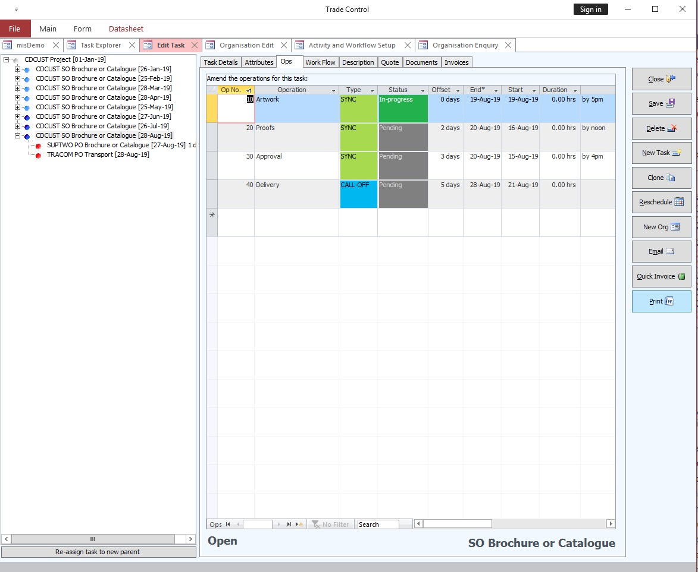

Like work flows, Operations also have an associated Sync Type - SYNC / ASYNC / CALL-OFF. Selecting the required Sync 
Type defines the way in which TC automatically assigns dates to related activities and sets the Action On date 
to match the final CALL-OFF date:

SYNC - A SYNC date is synchronised to any related activities, so if the related activity is updated any SYNC dates 
will automatically be changed by the same number of working days as the related activity.

ASYNC - non-synchronised, ASYNC dates are not affected by any other date changes within Operations 

CALL-OFF - This is the date which synchronises with the Action On date, so updating the CALL-OFF date will cause the 
Action On date to be matched. Generally speaking, it will be the last activity, such as delivery of the completed 
order to the client or collection of the completed order from a supplier.

    Work Flow

The screen grab below shows the Work Flow for the sales task SW_10014 (following the same task through from the 
Attributes section):

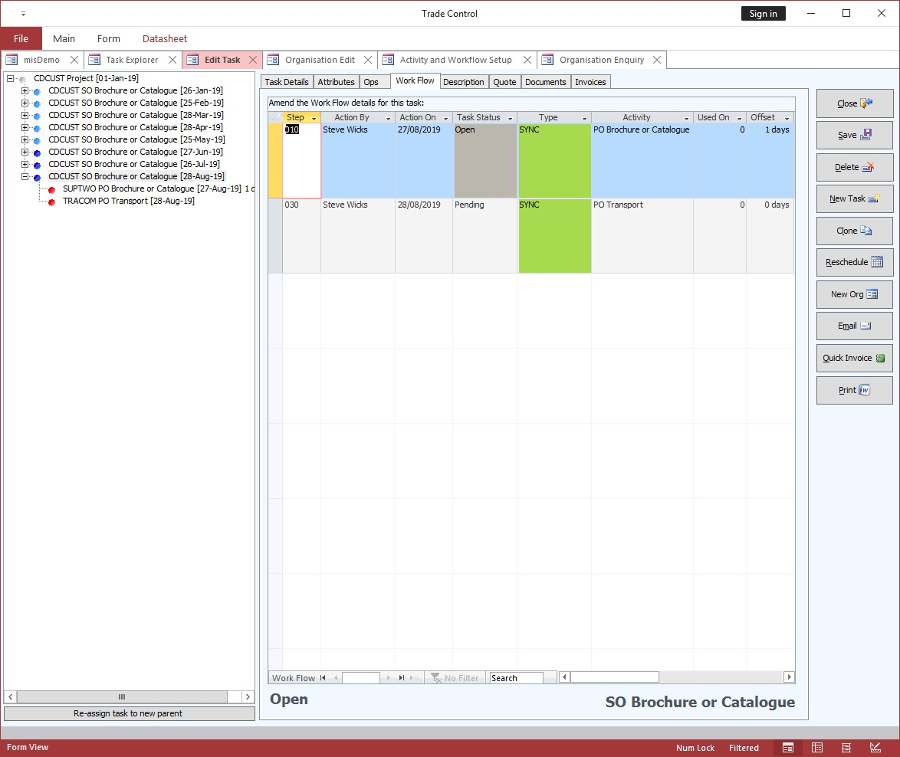

As the task we are looking at is a sales task, we can see two dependent child tasks which are automatically created 
due to the work flow setting in Activities. So, every time a new task with the Activity Code 
'SO Brochure or Catalogue' is created, the two child tasks are created at the same time.

    Quote

The Quote section has been modified specifically for the printing industry, but the basic functionality applies to 
any desired application. The basic requirement is to insert a quantity and a price in each row which will populate the quotation document. It is also a useful repository to access and maintain price levels for any tasks.

The 'Run on' and Run back' columns were added to reflect the need to show additional cost for additional copies either 
added to ('run on' from) the base quantity or deducted from ('run back' from) the base quantity. So, in the example 
below we see the base prices for various quantity break points, then the run on and run back costs for each quantity. 
But these extra columns are not necessary, users can just complete a row for each price break point as required. 

The Quote tab serves as both a pricing table which can be referred to internally to access agreed pricing levels 
which would be set up against the original task and would be copied over when the task was cloned, and it can also 
be used to populate the Quotation form, so the Quotation template will load the task attributes and show the prices 
and quantities as defined in the Quote tab. All attributes will appear in the quotation form but remember that those 
set to 'QUOTE' will only appear in the quotation and not in the order acknowledgement.

    Documents

Documents is a repository where any associated files can be stored within the task. To add a document, simply left 
click and type in a name in the Document Name field, then left click on the box below the Optional Description 
field. Then select 'Form' from the toolbar at the top of the page and select 'Insert Object'. You can either create 
a new document or select a location for an existing document and upload it to the task.

    Invoices

If the task has been Charged, the invoice details can be viewed in the Invoices tab, but note that you cannot open 
or edit invoices from this tab. To open or edit invoices see the Invoice Register section.

## Work Flow

Having covered the basic activities involved in creating and managing tasks, let us move onto the Work Flow section 
which can be accessed via the Work Flow tree in the Home menu. The following tabs can be found here: 

### Document Manager

There are two document systems for enabling documents generated within TC to be output and distributed:

- A Document Manager, which presents the document types in a traditional way, monitors if they have been sent, and 
can spool multiple orders in one generation.

- Word VSTO Templates that can be modified to match your business style, populated from XML schema.

Both can email a pdf document to the contact's address directly from within the client. Reports in the Document 
Manager are more flexible.

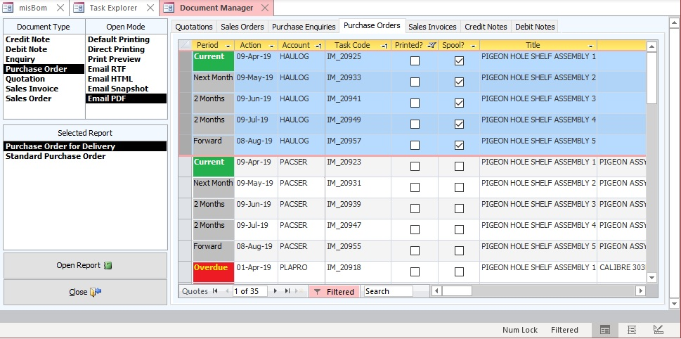

You can write your own reports, and then tell the Document Manager what report goes with which Document Type, and 
how it is to be communicated by default. These are listed in the Selected Report box.

There is no limit on the number of reports or Word Templates you can add to a Document Type. They are added in the 
Documents page of Administration. Word Templates are located locally, whereas Manager configuration is universal. 
Therefore, to avoid error messages, you would need to distribute your new reports.

### Expenses

Expenses is where an entry can be made without having to create a Task first. Creating an expense entry automatically 
creates an expense task and you can decide whether you want to simply create the expense task or to create it and to 
pay it at the same time. 

Selecting Expenses from the Work Flow tree will open a new tab 'Paid Expenses'. Simply enter the required fields in 
the form (ensuring that you select the correct VAT code, as the code will default to the one set up within the 
Activity which may not always reflect the actual expense VAT e.g. a supplier may be supplying a VATable product or 
service but may not be VAT registered). 

Enter the Action On date and the Payment On date will automatically calculate based on the payment terms set up for 
the selected organisation. The cost may either be entered as a Total Charge or as a Unit Charge which 
will multiply by the number specified in the Quantity field (default quantity = 1). If a unit charge has been set up 
against the selected Activity it will automatically populate the Unit Charge field (see example for Employee 
Transport in screenshot below).

Multiple expense entries can be created and when all entries have been completed, click on the Post button (bottom 
left of screen) and you will be asked whether you want to Raise and Pay Expenses now Yes/No/Cancel? Clicking 'Yes' 
will raise the tasks and pay them at the same time, so the payments will appear in the Cash Statement and the task 
will be marked as Paid. Clicking 'No' will raise the tasks and set them to 'Closed' but will not pay them, so they 
will be shown in the Company Statement as pending payment. This is a very useful feature, as it allows for a quick 
and immediate creation and payment of an expense or for the creation only so the payment can be entered when the 
cash leaves the bank account, so your Cash Statement will reflect the exact order of your bank statements.

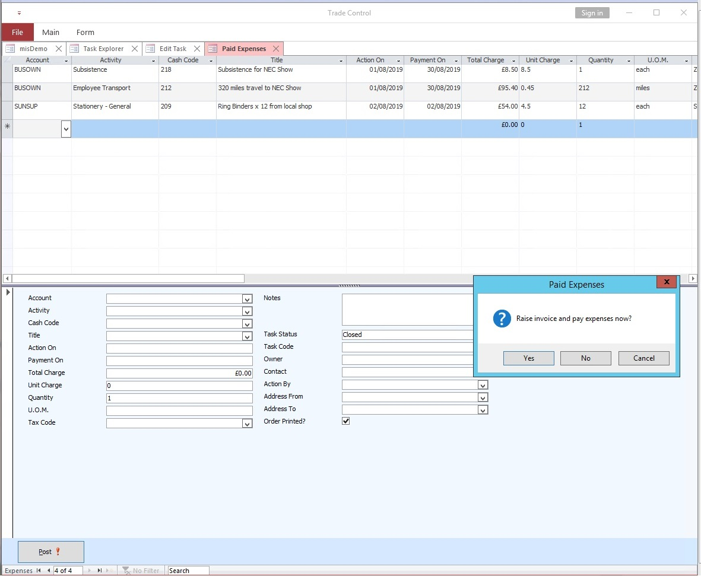
 
### Payment Entry

Selecting Payment Entry from the Work Flow tree will open the Payment Entry tab. Here you can post payments and 
receipts against existing tasks or you can assign an Activity Code which will override any existing tasks which 
might be pending payment for the selected organisation.

It is vital that users understand the way in which TC allocates payments and Payment Entry is a good way to 
demonstrate this. If you select an organisation which has a payment scheduled (income or outgoings) the system will 
select the oldest payment due date and allocate the payment to it unless a new Activity Code is entered and a new 
task is created. If a new Activity Code is selected against an organisation which has a payment scheduled, then a 
warning message will appear to advise that existing payments are set up, so users can choose to proceed with the new 
Activity Code or might realise that the task has already been invoiced and delete the new code so that the payment 
is allocated to the existing invoice.

Automatic allocation of payments will only occur when there is an invoiced task pending payment, so any open or 
closed tasks will not be included. In order to allow the system to allocate the payment automatically, simply enter 
the value and then tab through the Cash Code and Tax Code boxes. If no invoiced tasks can be found, an error message 
will appear.

Once you understand the way TC allocates payments, you will also understand that it cannot define whether the 
pending payment being posted is for one invoice or for multiple invoices, so it simply populates the Paid In or Paid 
Out field with the total outstanding amount currently showing for the selected organisation. It is therefore vital 
that users pay great attention to any value which the system automatically generates as it may well be different to 
what is being posted at that time. For example, a client has £3,000 of unpaid invoices, £1,000 60+ days old, £1,000 
30-59 days old and a current month invoice under 30 days old. TC will automatically populate the Paid In field with 
£3,000 so this must be overwritten with the value of the current payment. So, if a £1,000 is posted in Paid In, the 
system will allocate this against the oldest invoice (60+ days old), or if £2,000 is posted in Paid In it will 
allocate this against the two oldest invoices, leaving just the current invoice marked as unpaid.

Multiple payments can be created in the Payment Entry tab which will all be posted and allocated when you click 
'Post'. Any mis-postings can be corrected within the Cash Statement tab.

### Raise Invoices

Selecting Raise Invoices from the Work Flow tree will open the Raise Invoices tab. This tab can also be opened from 
the 'Invoicing' shortcut found in the Main header tab. Here you can select the Account using the dropdown menu 
which shows all outstanding all organisations with open or closed sales and purchase tasks which are pending 
invoicing. Selecting the required organisation will show all invoiceable tasks. Click on the task you require and 
click the Raise Invoice button.

An Invoice Edit screen will open and the cursor will go to the Invoiced On Date, so users can easily enter the invoice date 
if it is different to today's date which is the default. The Due On date will be calculated based on the 
invoice date + payment days as defined in Organisations and will calculate back to the closest working day as 
defined in the Calendar i.e. if payment falls due on a Saturday or a Sunday which are defined as non-working days 
then the Due On date will be calculated as the Friday before.

The Expected On date is the Due On date + any expected extra days as defined in Organisations. This is a very 
useful feature for cashflow forecasting as the payment will show in Company Statement as being received on the 
Expected On date, so payments from customers who regularly pay later than the specified terms can be automatically 
adjusted through their account settings, or an individual invoice can be created with a later Expected On date if 
earlier or later payment is anticipated which you want to reflect in the cashflow forecast.

The screen shot below shows the first tab of the Invoice Edit screen which opens on choosing to raise an invoice in 
the Raise Invoices section: 

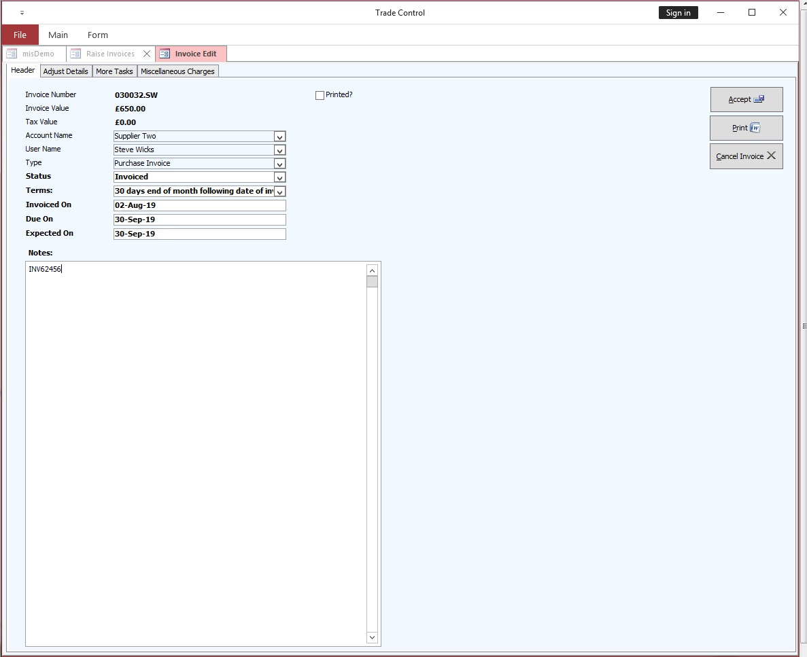

For this purchase invoice the terms are set to 30 days end of month. The invoice is created once the supplier's 
invoice is received, and the invoice number is entered in the free field 'Notes' section. Any text entered in 
'Notes' is set to print underneath the main invoice information on a Sales invoice document, so it is a useful 
way to add additional information to an invoice, such as a breakdown of unit costs which make up a total line 
within the invoice, or to enter any key information which may be required but is not part of the standard Sales 
invoice document template.

The next tab 'Adjust Details' enables users to adjust any details which are pulled through automatically from 
the task. Quantities and prices can be amended here and if amendments are made which affect values you will be 
asked whether you want to reconcile any amendments within the original task. Selecting Yes will update the task. 
The Actioned On date will be posted against the task

The 'More Tasks' tab will show any other invoiceable tasks for the selected organisation. Select additional tasks 
by highlighting the required task (if multiple tasks need to be added, hold down the Shift key and click on all 
required tasks). Click the 'Add Selected' button to include the tasks within the current invoice. Returning to 
the 'Adjust Details' tab will show a row for each selected task which can be edited if required. This is useful 
when creating an invoice for expenses, where all expense tasks for the month can be included in one invoice 
which enables one payment to be made and allocated to one invoice.

The 'Miscellaneous Charges' tab can be used to create a new task 'on the fly' to be added to the current invoice.

Once all of the required information has been entered, selecting 'Accept' will raise the invoice and close the 
Invoice Edit Screen. If you want to print the invoice, select 'Print' and the invoice will be raised at the same 
time as a Print Invoice screen opens. The default document template will be selected and clicking on the 'Word 
Document' button will open the invoice in Microsoft Word for editing or printing (provided 'Print Preview' has 
been checked in Administration - otherwise the invoice will be printed without previewing).

### Transfers

Selecting Transfers from the Work Flow tree will open the Transfers tab. This feature enables money to be 
transferred from one business bank account to another. The demo system has a current account and a reserve account 
and payments in can be created by selecting the receiving account and selecting 'Transfer Receipt' as the Cash Code. 
Payments out use the Cash Code 'Account Payment'. TC recognises the polarity of these Cash Codes, so if the amount 
for a payment in was entered incorrectly in the Paid Out instead of the Paid in column, selecting Transfer Receipt 
as the Cash Code would automatically move the value into Paid In.

All Transfers will show in Company Statement, so if the cashflow forecast shows that the current account moves into 
a negative balance based on the payment in/out dates as defined by the Invoice Register, then a Transfer can be set 
up to restore a positive cash balance. Excess current account funds can also be identified within Company Statement 
and a Transfer set up to the interest-bearing reserve account. To transact the transfer and update the bank account 
balances simply select the row for the payment in or out and click the 'Post Selected' button.

## Administration

The Administration tab can be opened by expanding 'Settings' from the Home screen. Administration is where all the 
company settings are created. There are multiple tabs:

    Company

This section is quite self-explanatory. There are multiple tabs to set up your company's details.

    Users
    
Multiple users can be created here, and administrator rights assigned.

    Period End

Here the Financial Years and periods are set up. The initial view when opening the Period End tab show the months 
condensed, with only the year view shown. Clicking on the + button to the left of the Year expands the tree to show 
the months, as the screen shot below:

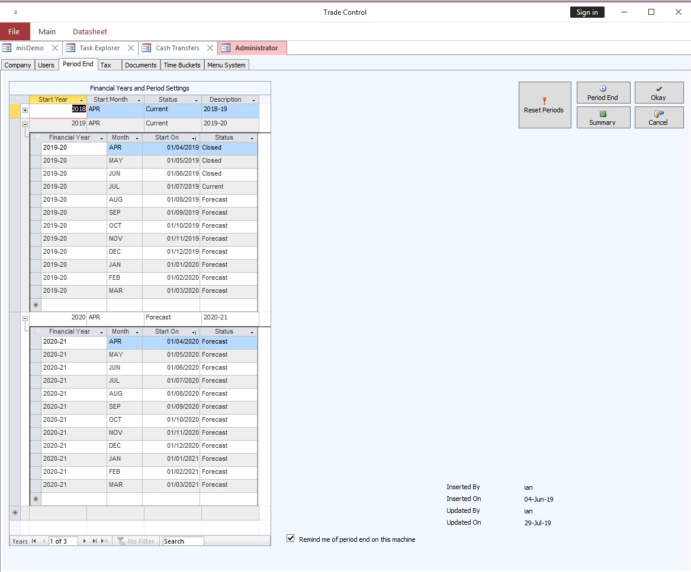

Administrators must ensure that the periods have been created in advance to enable TC to create tasks which fall 
into the period. You will see that this snapshot was taken in July 2019 and shows it as the Current month, with 
April-June showing as Closed as all transactions for these months have been posted and reconciled before clicking 
on the 'Period End' button on the right to close the current period. All future months are set as Forecast.

    Tax

The Tax tab enables administrators to set a Tax Horizon, which will define how far forward tax payments are 
calculated and shown in Company Statement. The test system is set to 2 years (730 days).

The Tax Types are set up here and a Cash Code allocated, along with tax payment frequency (Recurrence) and tax 
period start months. Offset is the amount of days after the tax period end to be added on to arrive at the tax 
payment due date. You will see that the VAT offset in the test system is set to 31 days, so any VAT payments or 
receipts will show in the Company Statement cashflow forecast 31 days after the end of the quarter.

TC allows multiple tax rates to be set up which can then be allocated to a Cash Code, so when an Activity Code 
is created which is linked to that Cash Code it will be set with the defined tax rate.

Tax Rates are set in the right-hand section of the screen. The months are created automatically based on those 
created in the Period End table and rates copy over from the previous period. In the test system we have set up 
fictitious Corporation Tax rates to show that the % rate can be changed from one year to the next.

The Corp. Adjust and VAT Adjust columns allow administrators to adjust a period. Typically, this would 
be useful in reconciling actual VAT paid to invoiced VAT. Some suppliers may show individual line items and 
calculate VAT on these such that the total VAT is not exactly the correct percentage of the total excluding VAT. 
If the items have been ordered on TC as one total task, the VAT will be calculated at the correct percentage of the 
total cost and this cannot be amended within the purchase invoice, leading to a small discrepancy in the VAT for 
the period in question. Entering a balancing value in VAT Adjust will correct the VAT calculation.

    Documents

The Invoice Numbering Register within Documents is where the starting number range is set for Sales Invoices, 
Credit Notes, Purchase Invoices and Debit Notes. The Task Numbering Register is where the number range is set for 
Expense, Project, Purchases and Sales tasks.

To the right of the Documents screen is where administrators can set Access and Word documents and reports paths.

TC uses Word document templates with XML tags to populate the document with the current dataset from the selected 
file when opening the designated document. These templates are in the .../Templates folder and each has its 
own folder. If you want to adapt a template, locate the folder in which the Word .dotx template file is held. Copy 
and paste the .dotx file into the existing folder and it will automatically be saved under the original filename but 
with ' copy' appended to the filename. So the Order Acknowledgement template 'docAcknowledgement.dotx' is copied to 
become 'docAcknowledgement copy.dotx'.

Now, right click on the copied file and whilst holding the Shift key down, click 'Open' from the dropdown menu. Ensure 
that you keep the Shift key held down until the document opens in the background. Click on the open Word document to 
view the copied template. You will see a sparse document with only the generic text shown which is not dynamically 
created but exists as a fixed wording in every document created from that template. The XML tags are not visible, so 
to view and reposition or delete a tag you will need to do the following:

1. Right click on 'File' top left of screen within the Word document
2. Select 'Customise the Ribbon'
3. From the 'Main Tabs' list, tick 'Developer' to display the Developer menu in the ribbon at the top of the page (next to 'View')
4. Left click on 'Developer' and select 'Design Mode'. The XML tags will now be visible within the document template.

To see which tag relates to which piece of data generated by TC, left click on the tag and then left click 
'Properties' to display the XML tag name e.g. ContactName. You can then either move the tag to a different position 
in relation to the fixed text or delete it. At an advanced level, any data field held within TC can be selected via 
an XML tag so it is generated and inserted into the document, but for the purposes of this demo you can only use the 
existing tags which have been created for each document template.

There are now two choices - either overwrite the original template or create a new one so you can select either 
version within Document Manager when printing the document for the current task. TC will remember the last selected 
template for the specified document type and will automatically highlight this for selection within Document Manager.

To overwrite the original template, simply delete the original .dotx file and amend the name of the updated copy to 
match the original filename (i.e. delete ' copy from the filename). The path will remain unchanged so Document Manager 
will simply point to the same filename and the updated template will load.

To create a new template and keep the original, rename the updated copy to a meaningful filename - so if you had 
deleted the ContactName field, you could use the original filename with 'nocontact' added. So, let's assume we have 
a new template name 'docAcknowledgementnocontact.dotx' and now want to include this template in our dropdown list 
when Document Manager opens to print a Sales Order acknowledgement. To do this, open Administrator, go to Documents 
and select the Type (in this case Sales Order). Click in the next available row, enter a meaningful description such 
as 'Acknowledgement - no contact', then enter the filename 'docAcknowledgementnocontact.dotx' then copy and paste 
the Folder Name path from the row above. When Document Manager opens, you will see this template as an available 
option.

    Time Buckets

It is not necessary to adjust Time Buckets as the parameters are set to define how TC manages current and forecast 
calculations, but this tab enables advanced users to set up time periods by day, week or month and to define how 
tasks which fall within these time buckets to be reported in Task Explorer.

    Menu System

The Menu System enables administrators to control which areas of the system individual users can access and whether 
they can Read Only, Add or Edit entries within the modules they have access to.

NB there is no x/close button on the Administration tab. To close this section, click on either the 'OK' or 'Cancel' 
buttons on the right-hand side of the screen.

## Maintenance

Now let us look at the Maintenance section which is found in the Home Screen. Expanding this tree will reveal the 
following modules:

### Activities and Workflow

Selecting Activities from the Maintenance tree will open the Activity tabs. 
Definitions tab. 

    Details

The first tab shown is Details, where all Activities are shown, and new ones can be created. 
 
Selecting an Activity from the list on the right-hand side of the screen will load it into the editing table on 
the left of the screen. The Unit of Measure, default Task Status, Cash Code, Register Type (Dividend, Expense, 
Project, Purchase Order or Sales Order) and unit charge are entered. To set up a new Activity, click the Add New 
Button, enter the details and click the Save button. The new Activity will then appear in the list and can be 
selected when creating a task. To Edit, simply overwrite and click the Save button.

    Attributes

The Attributes tab is where all default Attributes are defined for each Activity. So simple tasks may not have any 
default Attributes, where some complex tasks may have many detailed Attributes assigned. The beauty of this design 
is that the base Attributes can be set up once for any Activity and every time that Activity is selected as a task 
it will load with the default attributes.  The Attributes can be set as line headings only, with no description, to 
enable users to enter the detail once they create the task, but having Attributes set up can ensure that nothing is 
missed e.g. the Activity must have an Attribute which states "Pagination" but this will change for each new task, 
so entering "Pagination" in the Attribute column but with no text in the Default Text field will only bring through 
the Attribute as a line heading, prompting the user to enter the pagination in the Description field within the 
task. Other generic Attributes can be set up with a default description as required e.g. the Activity must have an 
Attribute which states "Trade Tolerance +/-10% will apply to the final quantity delivered." Setting this up within 
Attributes for this Activity will ensure that the Attribute heading and description will appear within any new task 
created using this Attribute.

    Operations

Setting a default list of Operations within an Activity will create a schedule of Operations within any task created 
using that Activity Code. You will see that most Sales Order (SO prefix) Activities have Operations set up on the 
test system but not many Purchase (PO prefix) Activities. This is because the Purchase task will be a child task 
linked to the parent Sales task and if no Operations are defined, the child task will inherit the Operations 
schedule from the parent. So, where the Sales Activity has Operations linked to it in Activities, the Operations will be created automatically which will cascade down to any child tasks unless those 
tasks have their own Operations schedule. Looking at the Sales Activity "SO Book" there is a schedule of Operations 
including Artwork date, Proof date, Approval date and Delivery date. The order they appear is defined by the Op No. 
so can be easily rearranged by amending the numbers. When the new Sales task is created using this Activity Code, 
these Operations will appear and the dates for each one will be calculated based on the number of Offset days as 
entered in the Operations tab. Using the SO Book example, Delivery is offset by 7 working days from Artwork, so as 
the Delivery Type is set as Call-Off, this defines it as the Action On date from which any Synchronised Operations 
are calculated by working day from that date. So when the task is created the Artwork date will be 7 working days 
prior to the Delivery (Action On) date.

This method of defining Operations dates as Synchronised with the Action On date is great when a defined period of 
time will always apply between the Operations, but this will not always be the case so by setting the Operation Type 
to Async, the Operation will not be linked.

If a Purchase task requires a different schedule of Operations to the parent Sales task, a list of Operations can be 
set up against the Purchase Operation and this will create a separate schedule for the Purchase task. Or a schedule 
of Operations can be created manually from within the Purchase task. As an example, Purchase task SW_20021 (Account
Supplier Two) is a child task belonging to the parent Sales task SW_10012 (Account CD Customer). The Operations 
schedules look similar, but crucially the order is collected from the supplier one day before it is delivered by 
the transport supplier (Transport Company Limited) so the Call-Off (Action On) date is one day earlier than the 
Call-off (delivery) date shown in the Sales order. For this reason, a complete schedule of Operations must be 
created for each task - the Sales order, the Purchase order for the production and the Purchase order for the 
transport.

    Work Flow

Work Flow is where any associated tasks can be set up so that they are automatically created when a new task is 
created using the selected Activity Code. Using the example of Activity "SO Book", this has two Activities set up - 
PO Book and PO Transport - which will be created at the same time as any new "SO Book" task is created. The 'Step' 
number defines where the child task will sit in the tree structure - the lower the number, the higher it will be in 
the tree and the purchase order numbering will be determined by this hierarchy.

    Project

The Project tab shows the structure of the Activities and enables users to load any individual Activity for editing. 

### Budget

Selecting Budget from the Maintenance tree will open the Budget tab. Here, users can enter budget data by month/year 
and the values will appear within the linked Cashflow Forecast spreadsheet. First select the Category from the 
left-hand menu, then the Cash Code from the next column. Entering a value against a month will automatically create 
a tax value based on the tax status of the selected Cash Code. There are two tabs to the right-hand side of the screen, 
a Forecast where an overall value can be entered and a Projection where the forecast values can be viewed alongside 
the current system values.

### Definitions

Definitions is where the core data is set up to determine Units of Measure, Organisation Codes, Calendars, 
Cash Accounts and Cash Codes. Selecting Definitions from the Maintenance tree will open the Definitions 
tab.

***Lookup Data***

The first screen is Lookup Data where the following parameters are set:
    Unit of Measure 
Any Unit of Measure (UoM) defined in this table can be selected when creating Activities. The selected UoM will be 
displayed in Edit Task and will print out on any documents where the XML tag inserts this value.

    Organisation Types

Here, the Organisation Types are created, and the polarity of each type is set by defining whether it generates 
Expense, Income or is Neutral.

    Tax Codes

VAT, National Insurance and other tax codes can be created in this table. NB once a code has been allocated to an 
Activity, it must not be deleted. So, if tax rates change, a new code must be created and the original code and value 
must remain in the table.

***Calendar***

The working days of the standard week are set be ticking the required days. Holidays are inserted by clicking on the 
+ button and entering the holiday/non-working dates. These will be factored into any automatic scheduling by TC when 
looking at Operations offset days to determine Operation dates working back from the defined Call-Off (Action On) date. 

***Cash Accounts***

Cash Accounts is where bank accounts, loan accounts etc. are created and opening balances entered when setting up the 
system for the first time. In the Test System, there is a Dummy Bank Account which has no Cash Code allocated to it. 
This is an example of the flexibility of the system, as this account could be used to balance small anomalies without 
impacting on trading figures - for example, VAT rounding, or discrepancies on cash balances when importing from an 
existing system. There is a check box 'Dummy Account' which must be selected to prevent the account from 
showing in the Company Statement. Cash can be transferred between a live Cash Account and a dummy one and only the live 
account, with a valid Cash Code, will impact on the Cash Statement. 

***Cash Categories***

[Cash Categories](tc_cash_codes.md) are the top-level cash management codes. Once the Cash Categories are set up, Cash Codes can be 
created which will feed up into the selected Cash Category. Each Category must have a Mode (Expense/Income/Neutral), 
and a Type (Bank/Trade/External). Checking the Enabled box will post all transactions for that Cash Category into 
the Cash Flow forecast spreadsheet, leaving it unchecked will exclude the category from the forecast.

***Cash Codes***

Every Activity which has a financial impact on the company must be assigned a Cash Code to determine the polarity of 
any transaction by linking it to the Cash Category and to assign the required Tax Code. The 'Enabled' box must be 
checked to utilise a Cash Code. Leaving it unchecked means that it will not appear in the available list of 
Cash Codes when creating an Activity. This feature enables redundant Cash Codes to be effectively archived, where they 
can't be deleted if they are associated with an old Activity.

***Cash Totals***

Totals are explained in a separate section on the general structure of [Cash Codes](tc_cash_codes.md)

***Cash Expressions***

Administrators can create Cash Expressions using Excel formulae which will appear in the Cashflow Forecast linked 
spreadsheet. Two examples are shown, Gross Margin and Wages Ratio. The formula for each can be seen in the Formula 
Expression box. Using Xls syntax and inserting parameters by double-clicking on a category from the left-hand menu 
will create a formula which will appear in the Cashflow Forecast spreadsheet alongside the Category name, allowing 
dynamic calculations to be made when the spreadsheet is opened to show any key ratios which management may use to 
monitor business performance. This is another example of the flexibility of TC, enabling administrators to adapt and 
add to the power of the system without having to revert back to developers or employ programmers to manage their MIS platform.

### Organisation Datasheet

Selecting Organisation Datasheet from Maintenance tree opens a summary Organisation Edit tab. Here details can be 
viewed or edited for any existing organisation. This is a 'quick view' with limited data, so if any in-depth editing 
or a new organisation needs to be created, go to Organisations (see next section).

### Organisations

Selecting Organisations from Maintenance tree opens Organisation Edit tab. Here existing organisations can be updated 
or new ones created. To find an existing organisation, enter the first few letters into the Lookup box and the 
selection will load the organisation, then hit Return to load the details into the current screen.

To create a new organisation, click on the 'Form' view in the toolbar at the top of the page and click 'New' 
(highlighted in the screen grab below). Enter the organisation name and the system will create an Account Code which 
will comprise the first 3 characters of the first and second names combined (so British Crafts would be BRICRA). If you 
use a different coding system you can enter any sequence of numbers or letters up to 10 characters in total. To save the 
new record click 'Save' (the button below 'New').

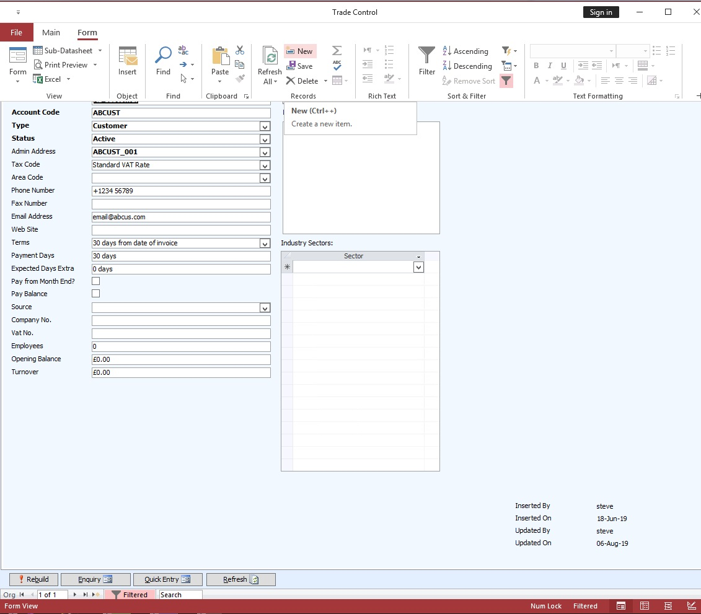

There are multiple tabs within the Organisation Datasheet as listed below:

    Details

Mostly self-explanatory, but it is important to understand how the Terms work. Entering text into the 'Terms' box will 
simply create an entry which will appear in invoices as a description of the agreed terms e.g. 30 days from date of 
invoice. The Payment Days must be entered in the next box as this value will automatically calculate the payment due 
date for each task. The next box is 'Expected Days Extra' which is a very useful extra feature, allowing the cashflow 
forecast as shown in Company Statement to account for customers who regularly pay outside of the agreed terms. Adding 
a value in this box will extend the expected payment received date by the desired number of days, leaving it blank 
will leave the expected payment date in the cashflow forecast as the payment due date.

    Addresses

One main address must be created which will be shown below the Organisation name in linked Word documents. Do not 
enter the Organisation name again here or it will appear twice! The account will automatically use the first entry 
in Addresses as the default address, but this can be amended by selecting an alternative entry in Details/Admin Address. 
Multiple addresses can be created against the Organisation which will be available to select when creating a task. 
It is important to understand that there are two ways of formatting an address entry:

1. Carriage return after each row to create a typical 5-6 row address as you would expect to see for an invoice 
header.
2. Enter as a continuous single line with commas instead of line breaks. This format allows delivery addresses to be 
shown within documents such as purchase orders and order acknowledgements without taking up 5 or 6 rows.
 
On the test system, you will see that some Organisations have been created with an initial entry (Address Code _001) 
using the first formatting with a second entry (Address Code _002), using the same address but using the second 
style of formatting. This will be the default for all customers as you will need both styles in order to create 
invoices using format 1 and sales order acknowledgements and supplier purchase orders using format 2. Generally, 
suppliers will only need format 1 as the delivery address shown in the purchase order will either be to another 
Organisation or to the Home account address.

In the screen grab below, you will see the two entries for AB Customer. In the second entry we have added a contact 
name and phone number so this will appear in the delivery address detail when Address Code ABCUST_002 is selected:
 
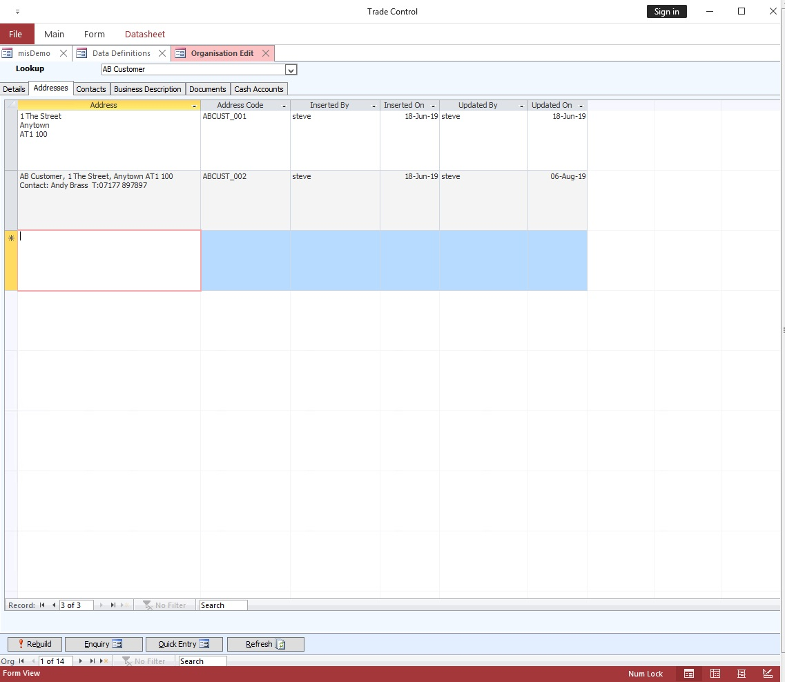

    Contacts 

This section is self-explanatory, but be aware that the Nick Name field is used for the salutation on some documents 
so must be present. Entering a new contact will create a Nick Name automatically using the first part of the Contact 
name field. This will not be visible until you tab through the fields to the next row, or if you refresh the screen 
after creating the entry. Alternatively, users can manually enter a Nick Name and the system will accept this and 
will not create an automatic entry.

    Business Description

A free field area where any text can be entered relating to the Organisation.

    Cash Accounts

A repository for bank and payment details

## Information
  
The next part of this documentation covers the Information section which is found in the Home Screen. Expanding this 
tree will reveal the following modules:

### Audit Accruals - Corporation Tax

Selecting Audit Accruals - Corporation Tax from the Information tree will open the Audit Accruals - Corporation Tax
tab. The system calculates Corporation Tax based on invoiced transactions, so when viewing the Corporation Tax tab 
in the Invoice Register the values will only reflect tasks which have been invoiced. Most companies will 
post sales invoices, purchase invoices and expense invoices intermittently through the course of a month and 
reconcile them at month-end when Corporation Tax accruals can be calculated. If a snapshot is taken it might be 
completely wrong as a large sales invoice might have been raised without the corresponding purchase invoice because 
the supplier's invoice has not been posted yet. This would inflate profit and therefore the Corporation Tax would be 
overstated. In order to accurately calculate Corporation Tax as a snapshot, all un-invoiced open or closed tasks must 
be accrued and therefore this section was created. A report will be opened when you open Audit Accruals - 
Corporation Tax which will list all un-invoiced tasks and total the order values and tax accrual adjustment which must 
be added to the Corporation Tax totals found in the Invoice Register to arrive at a net accrual. The Company 
Statement helpfully incorporates both values and shows two adjacent values - the top one being calculated on 
invoiced values and the one below based on the Audit Accruals values.

### Audit Accruals - VAT

Selecting Audit Accruals - VAT from the Information tree will open the Audit Accruals - VAT tab. 
This section works in the same way as Audit Accruals - Corporation Tax (see above). Un-invoiced tasks are listed here 
and a VAT calculation is shown by month which must be added to the VAT Totals values found in the Invoice Register. 
The Company Statement helpfully shows both values when they fall due for payment - the top one being calculated on 
invoiced values and the one below based on the Audit Accruals values.

### Cash Statement

Selecting Cash Statement from the Information tree will open the Cash Statement tab. The default Bank Account will 
open and the current month's financial transactions will be loaded. Selecting another month or a different Bank 
Account will load that data. If all transactions have been entered accurately the Cash Statement will reflect your 
bank statement exactly, making it easy for an accountant to identify every transaction within the system. If a 
posting has been made on the wrong date or to the wrong account or at an incorrect value, these problems can be 
corrected within Cash Statement. 

The screen grab below shows the Current Account for June 2019 on the test system: 

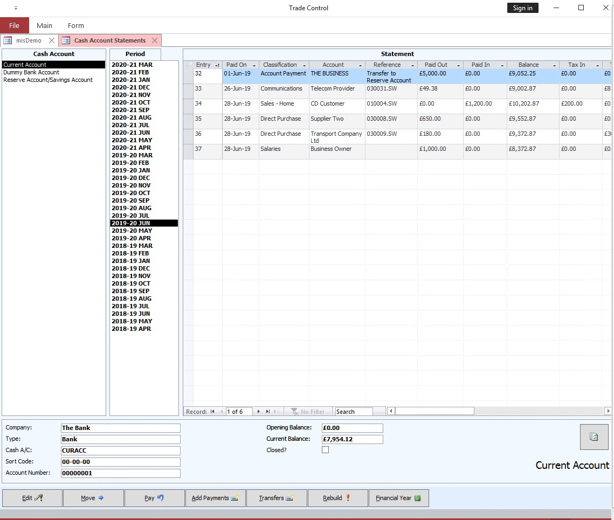

The Current Balance will feed into the Company Statement for cashflow forecasting so must always be checked to 
ensure that it is accurate. If a discrepancy is found, users can make adjustments by clicking on the buttons at 
the bottom of the screen:

    Edit

The Paid On Date, Payment Reference, Cash Code and Organisation can be edited in this section, or selecting 'Cancel' 
will delete the posting.

    Move

Transactions can be moved from one account to another if they have been mis-posted, to save having to delete the 
original transaction and post a new one. Simple select the Bank Account from the dropdown list and click 'Move'.

    Pay

Clickin the 'Pay' button opens the Payment Recharge section where Organisation, Cash Code, transaction value and VAT 
status can be edited.

The next two buttons on this screen are simply shortcuts: 'Add Payment' opens Payment Entry and 'Transfers' opens Cash Transfers

    Rebuild

You should not need to run the Re-build function, but if you do, under normal conditions it will have no effect. 
It is useful to integrate imported data into the system, repair corrupted data, an impacting upgrade or because 
certain essential information has been changed (like moving the financial year). Rebuilding is very resource-hungry 
so it is good practice to close all open tabs apart from Cash Statement before rebuilding.

    Financial Year

The 'Financial Year' button opens a printable report showing all financial transactions by month for the current financial 
year.

### Company Statement

Selecting Company Statement from the Information tree will open the Company Statement tab. The Company Statement 
may take longer to load than other modules as it performs some major calculations across the whole system.
It is a dynamically calculated snapshot of your business's position. If you modify any financial data from the past, 
or the future, it will impact on the either the opening balance, or its projection. 

There are two projections: one for the Current Account and the other for an optional Reserve Account. Current 
accounts have a Cash Code of type BANK, whereas the Cash Codes of Reserve Accounts are left blank. The first line 
in each is the current balance as recorded in the Cash Statement. The forward order book is overlaid onto the 
statement, along with Vat and Corporation Tax due, using their expected Payment On date. The forward balance is then 
projected from current balance across the active periods and tax horizons set in Administration.

From the Company Statement you can edit and reschedule orders, invoices and accruals or pay and collect from them. 
This gives you a great deal of control over your forward planning, because every time you amend the order book or 
pay an invoice, the vat and corporation tax will adjust accordingly, and there will be a new projection. And if you 
amend the past, the current balance changes so that it no longer matches your actual bank account, so it is easy to 
spot anything that requires reconciliation.

Because the Company Statement is dynamically calculated, it will depend where you are in the financial year as to 
how it will look for you. To amend the financial years and tax periods open the Tax and Period End pages of the 
Administrator where these settings can be modified.

When using Company Statement to project cashflow you will appreciate the importance of having the correct parameters 
set up across the system, from payment terms and Expected Days Extra (See Organisations) to Activities (Call-Off / 
Actioned On date) and financial postings (Payment Entry/Expense Entry/Cash Statement). When everything is correctly 
set up and transactions have been accurately posted and dated, the Company Statement will account for all cash 
movements to create an accurate cashflow forecast.

You can determine how far forward you want to forecast by changing the Task Status of repeat expense accruals such as 
phone costs, wages and operating expenses. If you have created a tree with the 'parent' task Activity Code set to 
'Project', all the forward accruals will have a Task Status assigned - usually these will be set to 'Pending' when 
the task is created and then activated by changing the status to 'Open'. Once the Task Status is set to either 'Open', 
'Closed' or 'Invoiced' it will appear in the Company Statement until it is paid. So, if you want to create a 3 month 
forward forecast simply update the Task Status of all expense accruals, salaries etc. to 'Open' for the current 
month + 2 months ahead and the Company Statement will account for them to be paid based on the 'Action On' date + 
any agreed payment terms + any Expected Days Extra as defined in the Organisation setup. For utility payments and 
salaries simply set the Organisation up with 0 days payment terms and the payment will accrue on the Action On date. 
For employee expenses, where you might want to set up a value accrual for personal expenses incurred through the 
month which are paid at the end of each month, simply set the employee up as an Organisation with 0 days payment 
terms and check the 'End of Month' box and all expenses will be shown on the last working day of the month in the 
Company Statement.

There is an 'Auto Refresh' button at the bottom of the Company Statement screen which, if selected, will automatically 
refresh the screen every time you click away to another tab. This ensures that any changes are updated every time 
you return to Company Statement but if you are posting multiple transactions, such as updating payments from your 
bank statement by clicking the 'Payment' button in Company Statement, you can lose time waiting for it to refresh 
after each posting. Unchecking the 'Auto Refresh' button will allow you to make multiple postings quickly and then 
you can either press F5 or re-check the 'Auto Refresh' button once you have finished to see the updated values.

The buttons at the bottom of the screen allow a range of options to edit or post payments against a selected task:

    Edit

Simply opens the task in Edit Task mode to enable adjustments, date changes or a shortcut to invoicing.

    Payment

Opens the Payment Entry screen and brings through the selected task for payment. NB see the Payment Entry section 
to ensure that you are aware of the way the system will bring through total values due and allocates them by 
expected payment date. Always check that the value you are paying is the value shown as the value shown by the system 
may include later payments due. If an error is made, it can be corrected within Cash Statement by either cancelling 
and reposting the transaction or by editing the value (see Cash Statement)

    Reschedule

Open the invoice details and allows the expected payment date to be quickly and easily adjusted.

    Org Enquiry

Opens the Organisation Enquiry screen to enable a detailed view of unpaid invoices, current balances and open orders.

    Org Edit

Opens the Organisation Edit screen to enable a quick rebuild of the individual account should this be required as a 
result of any reallocation of payments or retrospective modification of the invoice register.

### Data Warehouse

Selecting Data Warehouse from the Information tree will open the Data Warehouse tab.  Here all documents and images 
held on the system can be located and viewed, by Organisation or by Task.
 
### Invoice Register

Selecting Invoice Register from the Information tree will open the Invoice Register tab. Users can explore every 
invoiced task by month, with the current month selected by default. There are multiple tabs which are explained 
below:

    Sales Invoices

A list of all external sales invoices 

    Sales Items

Sales Items includes any internal sales (i.e. any positive cash transactions such as transfers in from other internal 
sources). Also, the associated task can be opened from here using the 'Edit' button at the bottom of the screen.

    Purchase Invoices

A list of all external purchase invoices which can be edited using the 'Edit' button at the bottom of the screen.
  

    Purchase Items

Purchase Items includes any internal purchases (i.e. any outgoing cash transactions such as transfers in from other 
internal sources). Also, the associated task can be opened from here using the 'Edit' button at the bottom of the 
screen.

    Cash Codes

A summary of invoices by cash code can be viewed here for the selected month.

    VAT Detail

Selecting the desired month from the list on the left-hand side of the screen will load the VAT details by VAT code.  

    VAT Totals

VAT Totals summarises the totals for the VAT quarter as defined in Administration. The VAT Detail totals for the 
quarter will be summated and displayed alongside the last month of the quarter, creating the basis for a VAT return. 
There is a complete section in the Help Text documentation on Making Tax Digital, but in essence TC can create a 
csv file containing all the data required to submit an electronic VAT return under the UK government's Making 
Tax Digital scheme. Clicking on the 'Generate csv export file' button at the bottom of the VAT Totals page will 
generate the required file which can then be linked to an inexpensive third party MTD approved software provider.

    Corporation Tax

Corporation Tax shows the historical and projected Corporation tax calculations for the current financial year.

    Unpaid Sales

Shows a list of all unpaid sales invoices which can be sorted by date/organisation/value.

    Unpaid Purchases

Shows a list of all unpaid purchase invoices which can be sorted by date/organisation/value.

    Expenses

Shows a list of Expense invoices which can be sorted by date/organisation/value. All Activities with an Expense 
Cash Code will appear in this section, enabling direct and indirect costs to be separated.

### Job Profit Status

Selecting Job Profit Status from the Information tree will open the Job Profit Status tab. Selecting the required 
month will display all invoiced income and outgoings and will show a gross profit total. Listed tasks can be edited 
using the 'Edit Task' button and reports can be generated using the 'Period' and 'Financial Year' buttons.

### Organisation Enquiry

Selecting Organisation Enquiry from the Information tree will open the Organisation Enquiry tab. This module can 
also be accessed via a button within Organisations, but it will not display the list of organisations which can be 
selected on the left-hand side of the screen, it will just load the current organisation selected in Organisations. 

When opening from the Information menu, select the desired organisation and then select a tab from the following list:

    Details

Displays organisation information as created in Organisations. To amend any data click the 'Edit' button to open the 
Organisation Edit screen.

    Payments

Displays all payments in and out of the account with any tax contained within the payment shown separately. To edit a 
payment you would need to open Cash Statements and trace the date of the entry (see Cash Statements).

    Statement

Displays invoices and payments. To edit a payment, you would need to open Cash Statements and trace the date of the entry 
(see Cash Statements) or to edit an invoice you would need to open Invoice Register and locate the invoice in either 
the Sales or Purchases within the month it was posted (see Invoice Register).

    Tasks

Displays all Tasks and their Task Status. On all previous tabs, clicking the Edit button would simply open the 
Organisation Edit screen, but within the Tasks tab you can select an entry by clicking on the row and clicking the Edit 
button will open the Edit Task screen to enable viewing and editing as required. 

    Sales Orders

Displays all Sales Orders (Tasks) for the selected organisation. You can select an entry by clicking on the row and 
clicking the Edit button will open the Edit Task screen to enable viewing and editing as required

    Sales Invoices

Displays all Sales Invoices for the selected organisation. you can select an entry by clicking on the row and clicking 
the Edit button will open the Invoice Register to enable viewing and editing as required.

    Purchase Orders

Displays all Purchase Orders (Tasks) for the selected organisation. You can select an entry by clicking on the row and 
clicking the Edit button will open the Edit Task screen to enable viewing and editing as required

    Purchase Invoices

Displays all Purchase Invoices for the selected organisation. You can select an entry by clicking on the row and 
clicking the Edit button will open the Invoice Register to enable viewing and editing as required.

    Item Invoices

Displays all Expense Invoices for the selected Organisation. You can select an entry by clicking on the row and 
clicking the Edit button will open the Expense Invoice to enable viewing and editing as required.

### Status Graphs

Selecting Status Graphs from the Information tree will open the Status Graphs tab which displays various pre-set reports. 
The current reports set up on the test system are Chargeable Tasks, Period Performance, Cash Position, Closing Balance 
and Invoice Register Summary showing purchases, sales and margin by month.

## Install Options

Returning to the [installation](#installation), there are four modes, allowing you to review how the system is constructed and 
deployed. If you select 'Activities Only' when installing the test database, you can see the pre-set 
activities in Activity and Workflow Setup and existing organisations and create your own entries from 
Task Explorer/New Task. You can see how the schedules can be automatically generated working back 
from the end date as defined by the selected activity, or can be created or adapted manually for 
each task.
 
If you then install the database again by selecting the 'Create Orders' option, you will be able to 
see the test data we have set up in Task Explorer and see how the hierarchy structures work, with 
tasks being linked in a simple parent/child structure on some orders and others being located 
together as a set of multiple related tasks together within a top-level parent 'placeholder' task. 
You can create and clone (copy) sales and purchase tasks, create expense tasks and view them in
Task Explorer. Check out the Company Statement to see how the system accrues incoming and outgoing 
payments based on the task completion dates to create a cashflow forecast.

You can then move onto installing the 'Invoice first order' database and see how we have invoiced 
historical jobs which changes the status of the tasks to 'Invoiced' so the invoices can be viewed 
by month in Invoice Register. You can experiment with the option to raise and pay an expense task 
simultaneously or to raise the task and invoice through the Company Statement module, which would 
be the typical route when posting payments as part of a bank statement reconciliation, where the 
expense task is created based on an expected payment date and is then posted as paid on the system 
based on the actual date the payment is taken. You will see how the VAT and Corporation Tax 
accruals are incorporated into the system totals once they are invoiced.

Finally, selecting 'Pay Invoices' when installing the database will enable you to see all 
actions up to and including payment and reconciliation. You can see the paid tasks in Cash Statement 
and within Organisations and check out how the Company Statement enables you to select a task and 
edit it, change the expected payment date or to post a payment. 
 
Re-running the installation, setting each option on in turn, re-creates the demo data to the selected level of completion. In so doing, you can obtain a vital understanding of 
the way the system accrues forward income and costs to generate a cashflow forecast and to calculate 
forward tax values to instantly give a real-time, dynamically calculated view of the business. 
 
It is important to note that any new tasks or invoices you have created will be deleted when you 
re-install the database as only the test data we have created will be loaded each time you run the 
installer.

## Licence

The Trade Control Code licence is issued by Trade Control Ltd under a [GNU General Public Licence v3.0](https://www.gnu.org/licenses/gpl-3.0.en.html) 

Trade Control Documentation by Trade Control Ltd is licenced under a [Creative Commons Attribution-ShareAlike 4.0 International License](http://creativecommons.org/licenses/by-sa/4.0/) 

 
